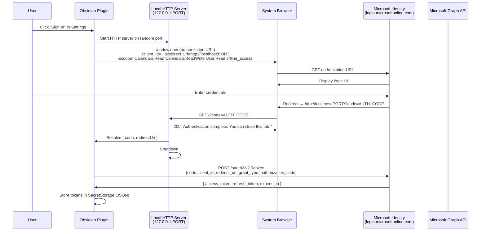
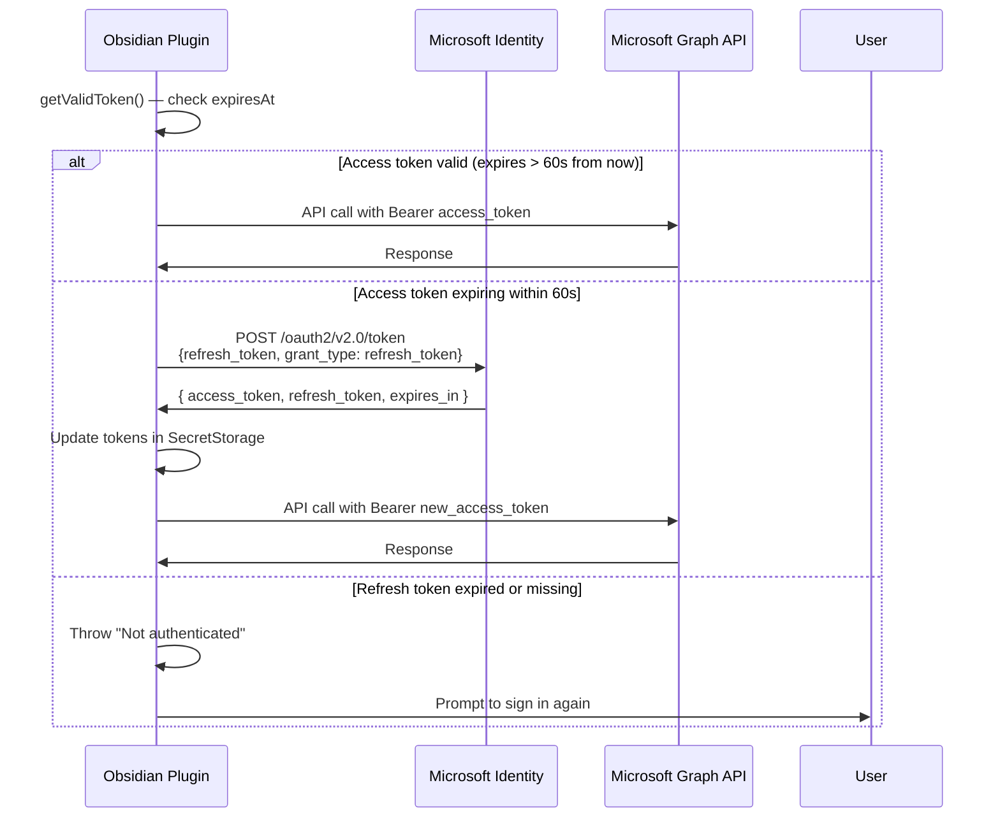

# Authentication Flow

## OAuth 2.0 Authorization Code Flow

## Silent Token Refresh

## Token Lifecycle

| Token | Typical Lifetime | Storage | Purpose |
|---|---|---|---|
| Access token | ~1 hour | `SecretStorage` (JSON blob) | Sent as `Bearer` header on every Graph request |
| Refresh token | 90 days (sliding) | `SecretStorage` (JSON blob) | Used to silently obtain new access tokens |

## Security Notes

- Tokens are **never** written to `data.json` — only stored in Obsidian's `SecretStorage` (local storage, vault-scoped)
- The local HTTP server binds to `127.0.0.1` only (not `0.0.0.0`)
- The server shuts down immediately after receiving the authorization code
- The auth flow times out after **120 seconds** if the user does not complete sign-in
- The plugin uses the **Authorization Code flow** (no client secret required for public clients)
