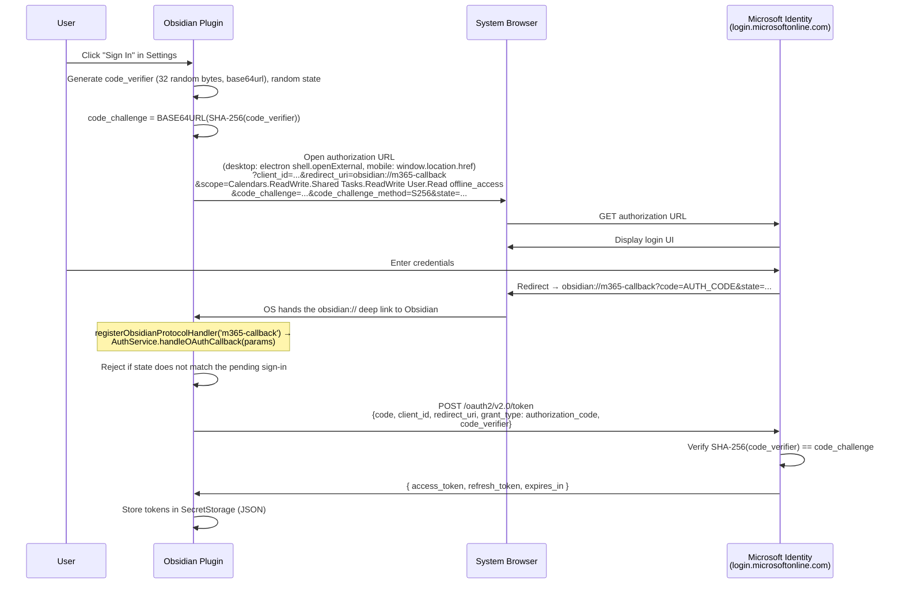
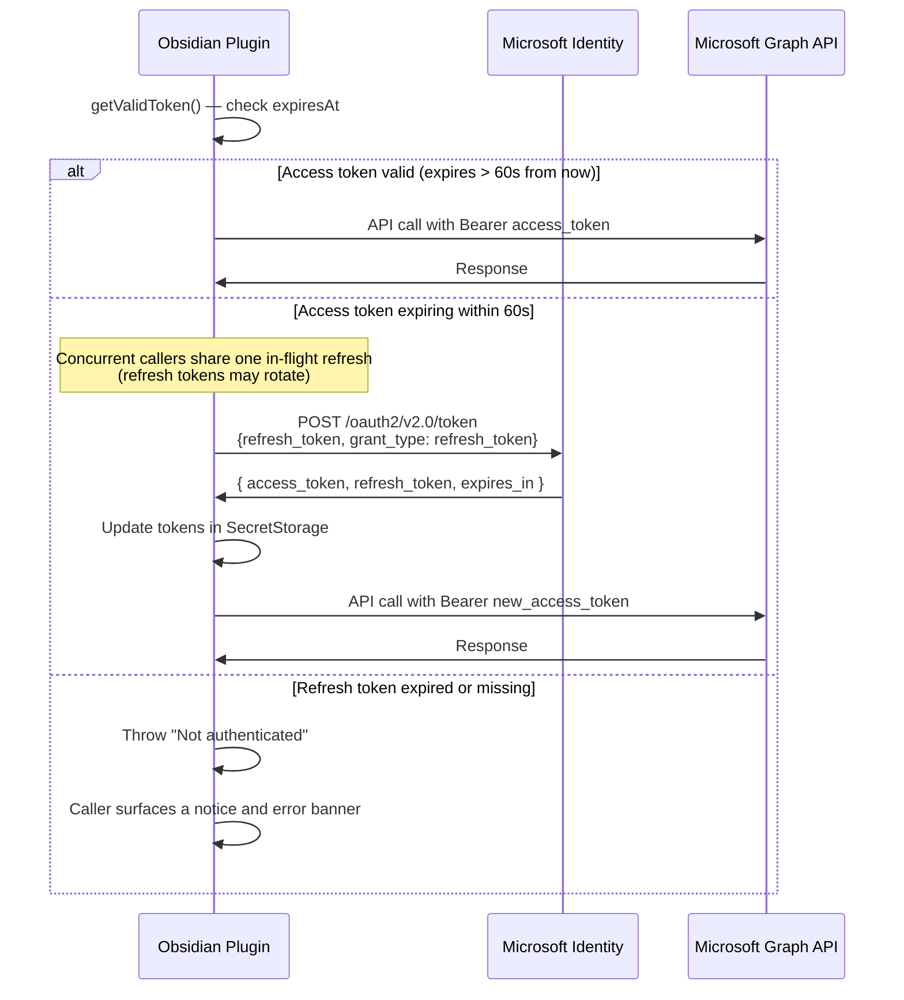

# Authentication Flow

## OAuth 2.0 Authorization Code Flow with PKCE

```mermaid
sequenceDiagram
    participant User
    participant Plugin as Obsidian Plugin
    participant Browser as System Browser
    participant MS as Microsoft Identity<br/>(login.microsoftonline.com)

    User->>Plugin: Click "Sign In" in Settings
    Plugin->>Plugin: Generate code_verifier (32 random bytes, base64url), random state
    Plugin->>Plugin: code_challenge = BASE64URL(SHA-256(code_verifier))
    Plugin->>Browser: Open authorization URL<br/>(desktop: electron shell.openExternal, mobile: window.location.href)<br/>?client_id=...&redirect_uri=obsidian://m365-callback<br/>&scope=Calendars.ReadWrite.Shared Tasks.ReadWrite User.Read offline_access<br/>&code_challenge=...&code_challenge_method=S256&state=...
    Browser->>MS: GET authorization URL
    MS->>Browser: Display login UI
    User->>MS: Enter credentials
    MS->>Browser: Redirect → obsidian://m365-callback?code=AUTH_CODE&state=...
    Browser->>Plugin: OS hands the obsidian:// deep link to Obsidian
    Note over Plugin: registerObsidianProtocolHandler('m365-callback') →<br/>AuthService.handleOAuthCallback(params)
    Plugin->>Plugin: Reject if state does not match the pending sign-in
    Plugin->>MS: POST /oauth2/v2.0/token<br/>{code, client_id, redirect_uri, grant_type: authorization_code,<br/>code_verifier}
    MS->>MS: Verify SHA-256(code_verifier) == code_challenge
    MS->>Plugin: { access_token, refresh_token, expires_in }
    Plugin->>Plugin: Store tokens in SecretStorage (JSON)
```

The redirect URI `obsidian://m365-callback` must be registered in the Azure app under
"Mobile and desktop applications". Because the redirect is an OS-level deep link, the same flow works on
desktop and mobile; no local HTTP server is involved.

## Silent Token Refresh

```mermaid
sequenceDiagram
    participant Plugin as Obsidian Plugin
    participant MS as Microsoft Identity
    participant Graph as Microsoft Graph API

    Plugin->>Plugin: getValidToken() — check expiresAt
    alt Access token valid (expires > 60s from now)
        Plugin->>Graph: API call with Bearer access_token
        Graph->>Plugin: Response
    else Access token expiring within 60s
        Note over Plugin: Concurrent callers share one in-flight refresh<br/>(refresh tokens may rotate)
        Plugin->>MS: POST /oauth2/v2.0/token<br/>{refresh_token, grant_type: refresh_token}
        MS->>Plugin: { access_token, refresh_token, expires_in }
        Plugin->>Plugin: Update tokens in SecretStorage
        Plugin->>Graph: API call with Bearer new_access_token
        Graph->>Plugin: Response
    else Refresh token expired or missing
        Plugin->>Plugin: Throw "Not authenticated"
        Plugin->>Plugin: Caller surfaces a notice and error banner
    end
```

## Token Lifecycle

| Token | Typical Lifetime | Storage | Purpose |
|---|---|---|---|
| Access token | ~1 hour | `SecretStorage` (JSON blob) | Sent as `Bearer` header on every Graph request |
| Refresh token | 90 days (sliding) | `SecretStorage` (JSON blob) | Used to silently obtain new access tokens |

## Security Notes

- Tokens are **never** written to `data.json` — only stored in Obsidian's `SecretStorage` (local storage, vault-scoped)
- The callback is validated with a random `state` value; a callback whose `state` does not match the pending sign-in is rejected
- The auth flow times out after **120 seconds** if the user does not complete sign-in
- **PKCE** (Proof Key for Code Exchange, S256) is used on every sign-in — a fresh `code_verifier`/`code_challenge` pair is generated per session, preventing authorization code interception attacks
- Concurrent token refreshes are coalesced into a single request, so parallel Graph calls cannot invalidate each other's rotated refresh token
- The storage key for tokens is hardcoded as `m365-calendar-token` and is not user-configurable
