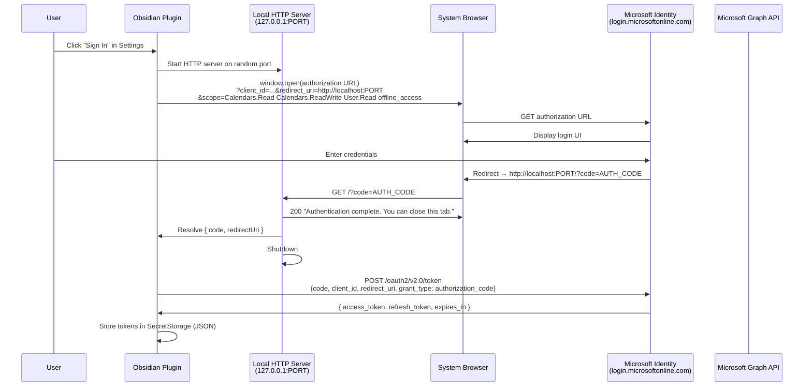
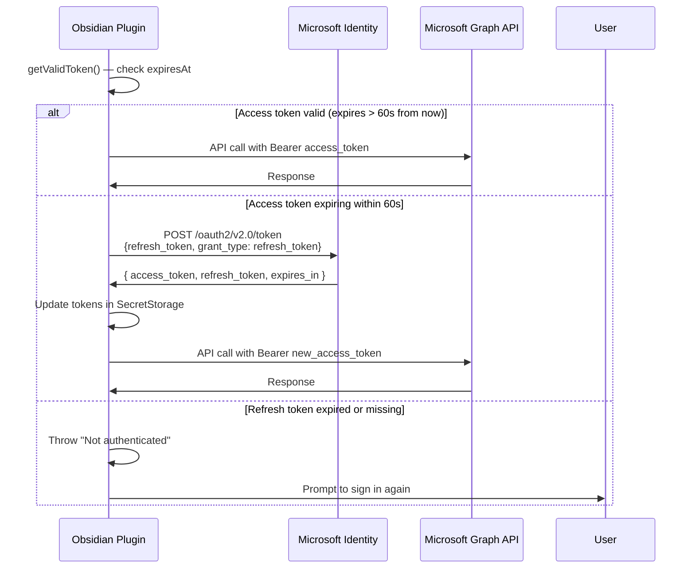

# M365 Calendar Plugin Implementation Plan

> **For agentic workers:** REQUIRED SUB-SKILL: Use superpowers:subagent-driven-development (recommended) or superpowers:executing-plans to implement this plan task-by-task. Steps use checkbox (`- [ ]`) syntax for tracking.

**Goal:** Build an Obsidian plugin that renders Microsoft 365 calendars (month + week views) with OAuth authentication, local caching, and event creation.

**Architecture:** Three-layer design — Obsidian bridge (`main.ts`, `view.tsx`, `settings.ts`) wires together the React UI layer (pure React components tested in isolation) and the Graph service layer (pure TypeScript classes: `AuthService`, `CalendarService`, `CacheService`). The bridge is the only layer that imports from `obsidian`.

**Tech Stack:** TypeScript, React 18, esbuild (Obsidian build), Vitest + @testing-library/react (tests), Microsoft Graph API, Azure AD OAuth 2.0.

---

## File Map

| File | Purpose |
|---|---|
| `src/types/index.ts` | Shared TypeScript interfaces |
| `src/services/CacheService.ts` | Local JSON cache via injected load/save callbacks |
| `src/services/AuthService.ts` | Azure AD OAuth flow + token refresh |
| `src/services/CalendarService.ts` | Microsoft Graph API calls |
| `src/context.ts` | React AppContext + `useAppContext` hook |
| `src/components/EventCard.tsx` | Single event display with calendar colour |
| `src/components/CalendarSelector.tsx` | Per-calendar enable/disable toggles |
| `src/components/Toolbar.tsx` | View toggle, date navigation, refresh button |
| `src/components/MonthView.tsx` | Month grid with event cards |
| `src/components/WeekView.tsx` | 7-column week layout with event cards |
| `src/components/CreateEventModal.tsx` | Obsidian Modal wrapping a React form |
| `src/components/CalendarApp.tsx` | Root component — owns all state and data fetching |
| `src/settings.ts` | Settings interface, defaults, and settings tab |
| `src/view.tsx` | `ItemView` subclass — mounts React root |
| `src/main.ts` | Plugin entry point — lifecycle and wiring |
| `styles.css` | Scoped CSS using Obsidian CSS variables |
| `manifest.json` | Obsidian plugin manifest |
| `versions.json` | Plugin version → min Obsidian version map |
| `version-bump.mjs` | Syncs `manifest.json` + `versions.json` on `npm version` |
| `esbuild.config.mjs` | Obsidian bundle build config |
| `vitest.config.ts` | Vitest configuration |
| `eslint.config.mts` | ESLint configuration |
| `tsconfig.json` | TypeScript compiler config |
| `package.json` | Dependencies and scripts |
| `.npmrc` | Removes `v` prefix from version tags (required for BRAT) |
| `.gitignore` | Ignores `node_modules`, `main.js`, sourcemaps |
| `tests/setup.ts` | Vitest global setup (@testing-library/jest-dom) |
| `.github/workflows/ci.yml` | PR checks: lint, typecheck, test (parallel) |
| `.github/workflows/release.yml` | On merge to main: build + GitHub release for BRAT |
| `scripts/install.sh` | Install built plugin to a local vault |
| `README.md` | User-facing setup and usage guide |
| `docs/architecture/auth-flow.md` | MermaidJS OAuth sequence diagram |

---

## Task 1: Git Init + Project Scaffold

**Files:**
- Create: `package.json`
- Create: `tsconfig.json`
- Create: `esbuild.config.mjs`
- Create: `vitest.config.ts`
- Create: `eslint.config.mts`
- Create: `manifest.json`
- Create: `versions.json`
- Create: `version-bump.mjs`
- Create: `.npmrc`
- Create: `.gitignore`
- Create: `tests/setup.ts`

- [ ] **Step 1: Initialise git and create all config files**

```bash
cd /path/to/m365-calendar
git init
```

Create `package.json`:
```json
{
  "name": "obsidian-m365-calendar",
  "version": "0.1.0",
  "description": "Microsoft 365 calendar view for Obsidian",
  "main": "main.js",
  "type": "module",
  "scripts": {
    "dev": "node esbuild.config.mjs",
    "build": "tsc -noEmit -skipLibCheck && node esbuild.config.mjs production",
    "test": "vitest run",
    "test:watch": "vitest",
    "typecheck": "tsc --noEmit",
    "lint": "eslint src/",
    "version": "node version-bump.mjs && git add manifest.json versions.json"
  },
  "devDependencies": {
    "@eslint/js": "9.30.1",
    "@testing-library/jest-dom": "^6.0.0",
    "@testing-library/react": "^16.0.0",
    "@testing-library/user-event": "^14.0.0",
    "@types/node": "^20.0.0",
    "@types/react": "^18.0.0",
    "@types/react-dom": "^18.0.0",
    "esbuild": "0.25.5",
    "eslint-plugin-obsidianmd": "0.1.9",
    "globals": "14.0.0",
    "jsdom": "^25.0.0",
    "jiti": "2.6.1",
    "tslib": "2.4.0",
    "typescript": "^5.8.3",
    "typescript-eslint": "8.35.1",
    "vitest": "^2.0.0"
  },
  "dependencies": {
    "obsidian": "latest",
    "react": "^18.0.0",
    "react-dom": "^18.0.0"
  }
}
```

Create `tsconfig.json`:
```json
{
  "compilerOptions": {
    "baseUrl": ".",
    "inlineSourceMap": true,
    "inlineSources": true,
    "module": "ESNext",
    "target": "ES2018",
    "allowImportingTsExtensions": true,
    "moduleResolution": "bundler",
    "importHelpers": true,
    "isolatedModules": true,
    "strictNullChecks": true,
    "lib": ["ES6", "DOM"],
    "jsx": "react-jsx"
  },
  "include": ["src/**/*.ts", "src/**/*.tsx"]
}
```

Create `esbuild.config.mjs`:
```js
import esbuild from 'esbuild';
import process from 'process';
import builtins from 'builtin-modules';

const prod = process.argv[2] === 'production';

const context = await esbuild.context({
  entryPoints: ['src/main.ts'],
  bundle: true,
  external: [
    'obsidian',
    'electron',
    '@codemirror/autocomplete',
    '@codemirror/collab',
    '@codemirror/commands',
    '@codemirror/language',
    '@codemirror/lint',
    '@codemirror/search',
    '@codemirror/state',
    '@codemirror/view',
    '@lezer/common',
    '@lezer/highlight',
    '@lezer/lr',
    ...builtins,
  ],
  format: 'cjs',
  target: 'es2018',
  logLevel: 'info',
  sourcemap: prod ? false : 'inline',
  treeShaking: true,
  outfile: 'main.js',
  jsx: 'automatic',
});

if (prod) {
  await context.rebuild();
  process.exit(0);
} else {
  await context.watch();
}
```

Create `vitest.config.ts`:
```ts
import { defineConfig } from 'vitest/config';

export default defineConfig({
  test: {
    environment: 'jsdom',
    globals: true,
    setupFiles: ['./tests/setup.ts'],
  },
});
```

Create `eslint.config.mts`:
```ts
import js from '@eslint/js';
import tseslint from 'typescript-eslint';
import obsidian from 'eslint-plugin-obsidianmd';

export default tseslint.config(
  js.configs.recommended,
  ...tseslint.configs.recommended,
  obsidian.configs.all,
  {
    rules: {
      '@typescript-eslint/no-explicit-any': 'warn',
    },
  },
);
```

Create `manifest.json`:
```json
{
  "id": "m365-calendar",
  "name": "M365 Calendar",
  "version": "0.1.0",
  "minAppVersion": "1.0.0",
  "description": "Microsoft 365 calendar view for Obsidian",
  "author": "Your Name",
  "authorUrl": "",
  "isDesktopOnly": true
}
```

Create `versions.json`:
```json
{
  "0.1.0": "1.0.0"
}
```

Create `version-bump.mjs`:
```js
import { readFileSync, writeFileSync } from 'fs';

const targetVersion = process.env.npm_package_version;

const manifest = JSON.parse(readFileSync('manifest.json', 'utf8'));
const { minAppVersion } = manifest;
manifest.version = targetVersion;
writeFileSync('manifest.json', JSON.stringify(manifest, null, '\t'));

const versions = JSON.parse(readFileSync('versions.json', 'utf8'));
if (!Object.values(versions).includes(minAppVersion)) {
  versions[targetVersion] = minAppVersion;
  writeFileSync('versions.json', JSON.stringify(versions, null, '\t'));
}
```

Create `.npmrc`:
```
tag-version-prefix=""
```

Create `.gitignore`:
```
node_modules/
main.js
*.js.map
```

Create `tests/setup.ts`:
```ts
import '@testing-library/jest-dom';
```

- [ ] **Step 2: Install dependencies**

```bash
npm install
```

Expected: `node_modules/` created, no errors.

- [ ] **Step 3: Verify vitest runs**

```bash
npm run test
```

Expected: `No test files found` or similar — zero tests, zero failures.

- [ ] **Step 4: Commit scaffold**

```bash
git add .
git commit -m "chore: project scaffold — config, deps, tooling"
```

---

## Task 2: Shared TypeScript Types

**Files:**
- Create: `src/types/index.ts`

- [ ] **Step 1: Create types file**

```bash
mkdir -p src/types
```

Create `src/types/index.ts`:
```ts
export interface M365Calendar {
  id: string;
  name: string;
  color: string;
  isDefaultCalendar: boolean;
  canEdit: boolean;
}

export interface M365Event {
  id: string;
  subject: string;
  start: { dateTime: string; timeZone: string };
  end: { dateTime: string; timeZone: string };
  calendarId: string;
  isAllDay: boolean;
  bodyPreview?: string;
  webLink?: string;
}

export interface NewEventInput {
  subject: string;
  start: Date;
  end: Date;
  description?: string;
  isAllDay?: boolean;
}

export interface CachedEvents {
  events: M365Event[];
  fetchedAt: number;
}

export interface CacheStore {
  [key: string]: CachedEvents;
}

export interface M365CalendarSettings {
  clientId: string;
  tenantId: string;
  tokenSecretName: string;
  enabledCalendarIds: string[];
  defaultCalendarId: string;
  refreshIntervalMinutes: number;
  defaultView: 'month' | 'week';
}

export interface StoredTokens {
  accessToken: string;
  refreshToken: string;
  expiresAt: number;
}
```

- [ ] **Step 2: Verify typecheck passes**

```bash
npm run typecheck
```

Expected: No errors.

- [ ] **Step 3: Commit types**

```bash
git add src/types/index.ts
git commit -m "feat: add shared TypeScript types"
```

---

## Task 3: CacheService (TDD)

**Files:**
- Create: `src/services/CacheService.ts`
- Create: `tests/services/CacheService.test.ts`

- [ ] **Step 1: Write failing tests**

```bash
mkdir -p src/services tests/services
```

Create `tests/services/CacheService.test.ts`:
```ts
import { describe, it, expect, vi, beforeEach } from 'vitest';
import { CacheService } from '../../src/services/CacheService';
import { M365Event, CacheStore } from '../../src/types';

const mockEvent: M365Event = {
  id: 'evt1',
  subject: 'Test Event',
  start: { dateTime: '2026-04-04T09:00:00Z', timeZone: 'UTC' },
  end: { dateTime: '2026-04-04T10:00:00Z', timeZone: 'UTC' },
  calendarId: 'cal1',
  isAllDay: false,
};

describe('CacheService', () => {
  let load: ReturnType<typeof vi.fn>;
  let save: ReturnType<typeof vi.fn>;
  let cache: CacheService;

  beforeEach(async () => {
    load = vi.fn().mockResolvedValue({});
    save = vi.fn().mockResolvedValue(undefined);
    cache = new CacheService(load, save);
    await cache.init();
  });

  it('returns null for missing key', () => {
    expect(cache.get('missing')).toBeNull();
  });

  it('stores and retrieves events', async () => {
    await cache.set('key1', [mockEvent]);
    const result = cache.get('key1');
    expect(result?.events).toEqual([mockEvent]);
  });

  it('returns null for expired entries (> 24h old)', async () => {
    const staleStore: CacheStore = {
      key1: { events: [mockEvent], fetchedAt: Date.now() - 25 * 60 * 60 * 1000 },
    };
    const expiredCache = new CacheService(
      vi.fn().mockResolvedValue(staleStore),
      vi.fn().mockResolvedValue(undefined),
    );
    await expiredCache.init();
    expect(expiredCache.get('key1')).toBeNull();
  });

  it('purges only expired entries on init, keeps fresh ones', async () => {
    const mixedStore: CacheStore = {
      old: { events: [mockEvent], fetchedAt: Date.now() - 25 * 60 * 60 * 1000 },
      fresh: { events: [mockEvent], fetchedAt: Date.now() },
    };
    const c = new CacheService(
      vi.fn().mockResolvedValue(mixedStore),
      vi.fn().mockResolvedValue(undefined),
    );
    await c.init();
    expect(c.get('old')).toBeNull();
    expect(c.get('fresh')).not.toBeNull();
  });

  it('calls save when setting events', async () => {
    await cache.set('key2', [mockEvent]);
    expect(save).toHaveBeenCalled();
  });

  it('fresh entry within 24h is returned', async () => {
    await cache.set('key3', [mockEvent]);
    expect(cache.get('key3')).not.toBeNull();
  });
});
```

- [ ] **Step 2: Run tests to confirm they fail**

```bash
npm run test -- tests/services/CacheService.test.ts
```

Expected: FAIL — `Cannot find module '../../src/services/CacheService'`

- [ ] **Step 3: Implement CacheService**

Create `src/services/CacheService.ts`:
```ts
import { CachedEvents, CacheStore, M365Event } from '../types';

const CACHE_TTL_MS = 24 * 60 * 60 * 1000;

export class CacheService {
  private store: CacheStore = {};

  constructor(
    private readonly load: () => Promise<CacheStore>,
    private readonly save: (data: CacheStore) => Promise<void>,
  ) {}

  async init(): Promise<void> {
    const data = await this.load();
    this.store = data ?? {};
    this.purgeExpired();
  }

  get(key: string): CachedEvents | null {
    const entry = this.store[key];
    if (!entry) return null;
    if (Date.now() - entry.fetchedAt > CACHE_TTL_MS) return null;
    return entry;
  }

  async set(key: string, events: M365Event[]): Promise<void> {
    this.store[key] = { events, fetchedAt: Date.now() };
    await this.save(this.store);
  }

  purgeExpired(): void {
    const now = Date.now();
    for (const key of Object.keys(this.store)) {
      if (now - this.store[key].fetchedAt > CACHE_TTL_MS) {
        delete this.store[key];
      }
    }
  }
}
```

- [ ] **Step 4: Run tests to confirm they pass**

```bash
npm run test -- tests/services/CacheService.test.ts
```

Expected: PASS — 6 tests passing.

- [ ] **Step 5: Commit**

```bash
git add src/services/CacheService.ts tests/services/CacheService.test.ts
git commit -m "feat: add CacheService with 24h TTL and injected persistence"
```

---

## Task 4: AuthService (TDD)

**Files:**
- Create: `src/services/AuthService.ts`
- Create: `tests/services/AuthService.test.ts`

- [ ] **Step 1: Write failing tests**

Create `tests/services/AuthService.test.ts`:
```ts
import { describe, it, expect, vi, beforeEach, afterEach } from 'vitest';
import { AuthService } from '../../src/services/AuthService';
import { StoredTokens } from '../../src/types';

function makeTokens(expiresInMs: number): StoredTokens {
  return {
    accessToken: 'access-token',
    refreshToken: 'refresh-token',
    expiresAt: Date.now() + expiresInMs,
  };
}

describe('AuthService', () => {
  let getSecret: ReturnType<typeof vi.fn>;
  let setSecret: ReturnType<typeof vi.fn>;
  let auth: AuthService;

  beforeEach(() => {
    getSecret = vi.fn();
    setSecret = vi.fn().mockResolvedValue(undefined);
    auth = new AuthService('client-id', 'common', getSecret, setSecret, 'token-key');
  });

  afterEach(() => {
    vi.unstubAllGlobals();
  });

  it('isAuthenticated returns false when no token stored', async () => {
    getSecret.mockReturnValue(null);
    expect(await auth.isAuthenticated()).toBe(false);
  });

  it('isAuthenticated returns true when valid token exists', async () => {
    getSecret.mockReturnValue(JSON.stringify(makeTokens(120_000)));
    expect(await auth.isAuthenticated()).toBe(true);
  });

  it('getValidToken returns access token when not expired', async () => {
    getSecret.mockReturnValue(JSON.stringify(makeTokens(120_000)));
    expect(await auth.getValidToken()).toBe('access-token');
  });

  it('getValidToken throws when not authenticated', async () => {
    getSecret.mockReturnValue(null);
    await expect(auth.getValidToken()).rejects.toThrow('Not authenticated');
  });

  it('getValidToken refreshes token when within 60s buffer', async () => {
    getSecret.mockReturnValue(JSON.stringify(makeTokens(30_000)));
    vi.stubGlobal('fetch', vi.fn().mockResolvedValue({
      ok: true,
      json: () => Promise.resolve({
        access_token: 'new-token',
        refresh_token: 'new-refresh',
        expires_in: 3600,
      }),
    }));
    const token = await auth.getValidToken();
    expect(token).toBe('new-token');
    expect(setSecret).toHaveBeenCalled();
  });

  it('getValidToken throws when refresh fails', async () => {
    getSecret.mockReturnValue(JSON.stringify(makeTokens(30_000)));
    vi.stubGlobal('fetch', vi.fn().mockResolvedValue({
      ok: false,
      statusText: 'Unauthorized',
    }));
    await expect(auth.getValidToken()).rejects.toThrow('Token refresh failed');
  });

  it('signOut clears the stored secret', async () => {
    await auth.signOut();
    expect(setSecret).toHaveBeenCalledWith('token-key', '');
  });
});
```

- [ ] **Step 2: Run tests to confirm they fail**

```bash
npm run test -- tests/services/AuthService.test.ts
```

Expected: FAIL — `Cannot find module '../../src/services/AuthService'`

- [ ] **Step 3: Implement AuthService**

Create `src/services/AuthService.ts`:
```ts
import * as http from 'http';
import { StoredTokens } from '../types';

const GRAPH_SCOPES = [
  'Calendars.Read',
  'Calendars.ReadWrite',
  'User.Read',
  'offline_access',
];

export class AuthService {
  constructor(
    private readonly clientId: string,
    private readonly tenantId: string,
    private readonly getSecret: (name: string) => string | null,
    private readonly setSecret: (name: string, value: string) => Promise<void>,
    private readonly secretName: string,
  ) {}

  async isAuthenticated(): Promise<boolean> {
    try {
      await this.getValidToken();
      return true;
    } catch {
      return false;
    }
  }

  async getValidToken(): Promise<string> {
    const stored = this.getStoredTokens();
    if (!stored) throw new Error('Not authenticated');

    // If token expires in more than 60s, return it directly
    if (Date.now() < stored.expiresAt - 60_000) {
      return stored.accessToken;
    }

    return this.refreshAccessToken(stored.refreshToken);
  }

  async signIn(): Promise<void> {
    const { code, redirectUri } = await this.startLocalServer();
    const tokens = await this.exchangeCode(code, redirectUri);
    await this.storeTokens(tokens);
  }

  async signOut(): Promise<void> {
    await this.setSecret(this.secretName, '');
  }

  private getStoredTokens(): StoredTokens | null {
    const raw = this.getSecret(this.secretName);
    if (!raw) return null;
    try {
      return JSON.parse(raw) as StoredTokens;
    } catch {
      return null;
    }
  }

  private async storeTokens(tokens: StoredTokens): Promise<void> {
    await this.setSecret(this.secretName, JSON.stringify(tokens));
  }

  private async startLocalServer(): Promise<{ code: string; redirectUri: string }> {
    return new Promise((resolve, reject) => {
      const server = http.createServer((req, res) => {
        const url = new URL(req.url!, 'http://localhost');
        const code = url.searchParams.get('code');
        res.writeHead(200, { 'Content-Type': 'text/html' });
        res.end('<html><body><h1>Authentication complete. You can close this tab.</h1></body></html>');
        server.close();
        if (code) {
          const port = (server.address() as { port: number }).port;
          resolve({ code, redirectUri: `http://localhost:${port}` });
        } else {
          reject(new Error('No authorization code received'));
        }
      });

      server.listen(0, '127.0.0.1', () => {
        const port = (server.address() as { port: number }).port;
        const redirectUri = `http://localhost:${port}`;
        window.open(this.buildAuthUrl(redirectUri));
      });

      setTimeout(() => {
        server.close();
        reject(new Error('Authentication timed out after 120 seconds'));
      }, 120_000);
    });
  }

  private buildAuthUrl(redirectUri: string): string {
    const params = new URLSearchParams({
      client_id: this.clientId,
      response_type: 'code',
      redirect_uri: redirectUri,
      scope: GRAPH_SCOPES.join(' '),
      response_mode: 'query',
    });
    return `https://login.microsoftonline.com/${this.tenantId}/oauth2/v2.0/authorize?${params}`;
  }

  private async exchangeCode(code: string, redirectUri: string): Promise<StoredTokens> {
    const body = new URLSearchParams({
      client_id: this.clientId,
      code,
      redirect_uri: redirectUri,
      grant_type: 'authorization_code',
      scope: GRAPH_SCOPES.join(' '),
    });

    const response = await fetch(
      `https://login.microsoftonline.com/${this.tenantId}/oauth2/v2.0/token`,
      {
        method: 'POST',
        headers: { 'Content-Type': 'application/x-www-form-urlencoded' },
        body,
      },
    );

    if (!response.ok) throw new Error(`Token exchange failed: ${response.statusText}`);
    const data = await response.json();
    return {
      accessToken: data.access_token,
      refreshToken: data.refresh_token,
      expiresAt: Date.now() + data.expires_in * 1000,
    };
  }

  private async refreshAccessToken(refreshToken: string): Promise<string> {
    const body = new URLSearchParams({
      client_id: this.clientId,
      refresh_token: refreshToken,
      grant_type: 'refresh_token',
      scope: GRAPH_SCOPES.join(' '),
    });

    const response = await fetch(
      `https://login.microsoftonline.com/${this.tenantId}/oauth2/v2.0/token`,
      {
        method: 'POST',
        headers: { 'Content-Type': 'application/x-www-form-urlencoded' },
        body,
      },
    );

    if (!response.ok) throw new Error(`Token refresh failed: ${response.statusText}`);
    const data = await response.json();
    const tokens: StoredTokens = {
      accessToken: data.access_token,
      refreshToken: data.refresh_token ?? refreshToken,
      expiresAt: Date.now() + data.expires_in * 1000,
    };
    await this.storeTokens(tokens);
    return tokens.accessToken;
  }
}
```

- [ ] **Step 4: Run tests to confirm they pass**

```bash
npm run test -- tests/services/AuthService.test.ts
```

Expected: PASS — 7 tests passing.

- [ ] **Step 5: Commit**

```bash
git add src/services/AuthService.ts tests/services/AuthService.test.ts
git commit -m "feat: add AuthService with OAuth flow and token refresh"
```

---

## Task 5: CalendarService (TDD)

**Files:**
- Create: `src/services/CalendarService.ts`
- Create: `tests/services/CalendarService.test.ts`

- [ ] **Step 1: Write failing tests**

Create `tests/services/CalendarService.test.ts`:
```ts
import { describe, it, expect, vi, beforeEach, afterEach } from 'vitest';
import { CalendarService } from '../../src/services/CalendarService';
import { AuthService } from '../../src/services/AuthService';
import { CacheService } from '../../src/services/CacheService';
import { M365Event, CachedEvents } from '../../src/types';

const FAKE_EVENT_RESPONSE = {
  id: 'evt1',
  subject: 'Team Standup',
  start: { dateTime: '2026-04-04T09:00:00Z', timeZone: 'UTC' },
  end: { dateTime: '2026-04-04T09:30:00Z', timeZone: 'UTC' },
  isAllDay: false,
  bodyPreview: '',
  webLink: 'https://outlook.office.com/calendar/item/evt1',
};

const EXPECTED_EVENT: M365Event = {
  id: 'evt1',
  subject: 'Team Standup',
  start: { dateTime: '2026-04-04T09:00:00Z', timeZone: 'UTC' },
  end: { dateTime: '2026-04-04T09:30:00Z', timeZone: 'UTC' },
  calendarId: 'cal1',
  isAllDay: false,
  bodyPreview: '',
  webLink: 'https://outlook.office.com/calendar/item/evt1',
};

describe('CalendarService', () => {
  let auth: Pick<AuthService, 'getValidToken'>;
  let cache: Pick<CacheService, 'get' | 'set'>;
  let service: CalendarService;

  beforeEach(() => {
    auth = { getValidToken: vi.fn().mockResolvedValue('token') };
    cache = {
      get: vi.fn().mockReturnValue(null),
      set: vi.fn().mockResolvedValue(undefined),
    };
    service = new CalendarService(
      auth as AuthService,
      cache as CacheService,
    );
  });

  afterEach(() => {
    vi.unstubAllGlobals();
  });

  it('getCalendars maps Graph response correctly', async () => {
    vi.stubGlobal('fetch', vi.fn().mockResolvedValue({
      ok: true,
      json: () => Promise.resolve({
        value: [{
          id: 'cal1',
          name: 'My Calendar',
          hexColor: '#0078d4',
          isDefaultCalendar: true,
          canEdit: true,
        }],
      }),
    }));
    const calendars = await service.getCalendars();
    expect(calendars).toHaveLength(1);
    expect(calendars[0]).toEqual({
      id: 'cal1',
      name: 'My Calendar',
      color: '#0078d4',
      isDefaultCalendar: true,
      canEdit: true,
    });
  });

  it('getCalendars throws when Graph returns error', async () => {
    vi.stubGlobal('fetch', vi.fn().mockResolvedValue({
      ok: false,
      statusText: 'Unauthorized',
    }));
    await expect(service.getCalendars()).rejects.toThrow('Failed to fetch calendars: Unauthorized');
  });

  it('getEvents returns cached events when cache hits', async () => {
    const cached: CachedEvents = { events: [EXPECTED_EVENT], fetchedAt: Date.now() };
    (cache.get as ReturnType<typeof vi.fn>).mockReturnValue(cached);
    const events = await service.getEvents(['cal1'], new Date('2026-04-01'), new Date('2026-04-30'));
    expect(events).toEqual([EXPECTED_EVENT]);
    expect(fetch).not.toHaveBeenCalled();
  });

  it('getEvents fetches from Graph on cache miss and writes to cache', async () => {
    vi.stubGlobal('fetch', vi.fn().mockResolvedValue({
      ok: true,
      json: () => Promise.resolve({ value: [FAKE_EVENT_RESPONSE] }),
    }));
    const events = await service.getEvents(['cal1'], new Date('2026-04-01'), new Date('2026-04-30'));
    expect(events[0].subject).toBe('Team Standup');
    expect(events[0].calendarId).toBe('cal1');
    expect(cache.set).toHaveBeenCalled();
  });

  it('getEvents merges events from multiple calendars', async () => {
    vi.stubGlobal('fetch', vi.fn().mockResolvedValue({
      ok: true,
      json: () => Promise.resolve({ value: [FAKE_EVENT_RESPONSE] }),
    }));
    const events = await service.getEvents(
      ['cal1', 'cal2'],
      new Date('2026-04-01'),
      new Date('2026-04-30'),
    );
    expect(events).toHaveLength(2);
  });

  it('createEvent posts to Graph and returns mapped event', async () => {
    vi.stubGlobal('fetch', vi.fn().mockResolvedValue({
      ok: true,
      json: () => Promise.resolve({
        id: 'evt2',
        subject: 'New Event',
        start: { dateTime: '2026-04-05T10:00:00Z', timeZone: 'UTC' },
        end: { dateTime: '2026-04-05T11:00:00Z', timeZone: 'UTC' },
        isAllDay: false,
        bodyPreview: undefined,
        webLink: undefined,
      }),
    }));
    const event = await service.createEvent('cal1', {
      subject: 'New Event',
      start: new Date('2026-04-05T10:00:00Z'),
      end: new Date('2026-04-05T11:00:00Z'),
    });
    expect(event.subject).toBe('New Event');
    expect(event.calendarId).toBe('cal1');
    expect(event.id).toBe('evt2');
  });
});
```

- [ ] **Step 2: Run tests to confirm they fail**

```bash
npm run test -- tests/services/CalendarService.test.ts
```

Expected: FAIL — `Cannot find module '../../src/services/CalendarService'`

- [ ] **Step 3: Implement CalendarService**

Create `src/services/CalendarService.ts`:
```ts
import { M365Calendar, M365Event, NewEventInput } from '../types';
import { AuthService } from './AuthService';
import { CacheService } from './CacheService';

const GRAPH_BASE = 'https://graph.microsoft.com/v1.0';

export class CalendarService {
  constructor(
    private readonly auth: AuthService,
    private readonly cache: CacheService,
  ) {}

  async getCalendars(): Promise<M365Calendar[]> {
    const token = await this.auth.getValidToken();
    const response = await fetch(`${GRAPH_BASE}/me/calendars`, {
      headers: { Authorization: `Bearer ${token}` },
    });
    if (!response.ok) throw new Error(`Failed to fetch calendars: ${response.statusText}`);
    const data = await response.json();
    return data.value.map((c: Record<string, unknown>) => ({
      id: c.id,
      name: c.name,
      color: (c.hexColor as string) || (c.color as string) || '#0078d4',
      isDefaultCalendar: (c.isDefaultCalendar as boolean) ?? false,
      canEdit: (c.canEdit as boolean) ?? false,
    }));
  }

  async getEvents(calendarIds: string[], start: Date, end: Date): Promise<M365Event[]> {
    const results = await Promise.all(
      calendarIds.map((id) => this.getEventsForCalendar(id, start, end)),
    );
    return results.flat();
  }

  async createEvent(calendarId: string, input: NewEventInput): Promise<M365Event> {
    const token = await this.auth.getValidToken();
    const body = {
      subject: input.subject,
      body: { contentType: 'text', content: input.description ?? '' },
      start: { dateTime: input.start.toISOString(), timeZone: 'UTC' },
      end: { dateTime: input.end.toISOString(), timeZone: 'UTC' },
      isAllDay: input.isAllDay ?? false,
    };
    const response = await fetch(`${GRAPH_BASE}/me/calendars/${calendarId}/events`, {
      method: 'POST',
      headers: {
        Authorization: `Bearer ${token}`,
        'Content-Type': 'application/json',
      },
      body: JSON.stringify(body),
    });
    if (!response.ok) throw new Error(`Failed to create event: ${response.statusText}`);
    const data = await response.json();
    return this.mapEvent(data, calendarId);
  }

  private async getEventsForCalendar(
    calendarId: string,
    start: Date,
    end: Date,
  ): Promise<M365Event[]> {
    const cacheKey = `${calendarId}:${start.toISOString()}:${end.toISOString()}`;
    const cached = this.cache.get(cacheKey);
    if (cached) return cached.events;

    const token = await this.auth.getValidToken();
    const params = new URLSearchParams({
      startDateTime: start.toISOString(),
      endDateTime: end.toISOString(),
      $select: 'id,subject,start,end,isAllDay,bodyPreview,webLink',
    });
    const response = await fetch(
      `${GRAPH_BASE}/me/calendars/${calendarId}/calendarView?${params}`,
      { headers: { Authorization: `Bearer ${token}` } },
    );
    if (!response.ok) throw new Error(`Failed to fetch events: ${response.statusText}`);
    const data = await response.json();
    const events = data.value.map((e: Record<string, unknown>) =>
      this.mapEvent(e, calendarId),
    );
    await this.cache.set(cacheKey, events);
    return events;
  }

  private mapEvent(e: Record<string, unknown>, calendarId: string): M365Event {
    return {
      id: e.id as string,
      subject: e.subject as string,
      start: e.start as { dateTime: string; timeZone: string },
      end: e.end as { dateTime: string; timeZone: string },
      calendarId,
      isAllDay: (e.isAllDay as boolean) ?? false,
      bodyPreview: e.bodyPreview as string | undefined,
      webLink: e.webLink as string | undefined,
    };
  }
}
```

- [ ] **Step 4: Run tests to confirm they pass**

```bash
npm run test -- tests/services/CalendarService.test.ts
```

Expected: PASS — 6 tests passing.

- [ ] **Step 5: Confirm all service tests still pass**

```bash
npm run test -- tests/services/
```

Expected: PASS — all service tests passing.

- [ ] **Step 6: Commit**

```bash
git add src/services/CalendarService.ts tests/services/CalendarService.test.ts
git commit -m "feat: add CalendarService with Graph API integration and caching"
```

---

## Task 6: EventCard Component (TDD)

**Files:**
- Create: `src/components/EventCard.tsx`
- Create: `tests/components/EventCard.test.tsx`

- [ ] **Step 1: Write failing tests**

```bash
mkdir -p src/components tests/components
```

Create `tests/components/EventCard.test.tsx`:
```tsx
import { describe, it, expect } from 'vitest';
import { render, screen } from '@testing-library/react';
import { EventCard } from '../../src/components/EventCard';
import { M365Event, M365Calendar } from '../../src/types';

const calendar: M365Calendar = {
  id: 'cal1',
  name: 'Work',
  color: '#0078d4',
  isDefaultCalendar: true,
  canEdit: true,
};

const timedEvent: M365Event = {
  id: 'evt1',
  subject: 'Team Meeting',
  start: { dateTime: '2026-04-04T09:00:00', timeZone: 'UTC' },
  end: { dateTime: '2026-04-04T10:00:00', timeZone: 'UTC' },
  calendarId: 'cal1',
  isAllDay: false,
};

const allDayEvent: M365Event = {
  id: 'evt2',
  subject: 'Company Holiday',
  start: { dateTime: '2026-04-04T00:00:00', timeZone: 'UTC' },
  end: { dateTime: '2026-04-05T00:00:00', timeZone: 'UTC' },
  calendarId: 'cal1',
  isAllDay: true,
};

describe('EventCard', () => {
  it('renders the event subject', () => {
    render(<EventCard event={timedEvent} calendar={calendar} />);
    expect(screen.getByText('Team Meeting')).toBeInTheDocument();
  });

  it('applies calendar colour as left border', () => {
    const { container } = render(<EventCard event={timedEvent} calendar={calendar} />);
    const card = container.querySelector('.m365-calendar-event-card');
    expect(card).toHaveStyle({ borderLeftColor: '#0078d4' });
  });

  it('shows "All day" for all-day events', () => {
    render(<EventCard event={allDayEvent} calendar={calendar} />);
    expect(screen.getByText('All day')).toBeInTheDocument();
  });

  it('shows formatted time for timed events', () => {
    render(<EventCard event={timedEvent} calendar={calendar} />);
    // Time label should be present (format varies by locale, just check it's not "All day")
    expect(screen.queryByText('All day')).not.toBeInTheDocument();
    expect(document.querySelector('.m365-calendar-event-time')).toBeInTheDocument();
  });
});
```

- [ ] **Step 2: Run tests to confirm they fail**

```bash
npm run test -- tests/components/EventCard.test.tsx
```

Expected: FAIL — `Cannot find module '../../src/components/EventCard'`

- [ ] **Step 3: Implement EventCard**

Create `src/components/EventCard.tsx`:
```tsx
import React from 'react';
import { M365Event, M365Calendar } from '../types';

interface EventCardProps {
  event: M365Event;
  calendar: M365Calendar;
}

export const EventCard: React.FC<EventCardProps> = ({ event, calendar }) => {
  const startTime = new Date(event.start.dateTime);
  const timeLabel = event.isAllDay
    ? 'All day'
    : startTime.toLocaleTimeString([], { hour: '2-digit', minute: '2-digit' });

  return (
    <div
      className="m365-calendar-event-card"
      style={{ borderLeftColor: calendar.color }}
      title={event.subject}
    >
      <span className="m365-calendar-event-time">{timeLabel}</span>
      <span className="m365-calendar-event-title">{event.subject}</span>
    </div>
  );
};
```

- [ ] **Step 4: Run tests to confirm they pass**

```bash
npm run test -- tests/components/EventCard.test.tsx
```

Expected: PASS — 4 tests passing.

- [ ] **Step 5: Commit**

```bash
git add src/components/EventCard.tsx tests/components/EventCard.test.tsx
git commit -m "feat: add EventCard component with colour-coded calendar border"
```

---

## Task 7: CalendarSelector Component (TDD)

**Files:**
- Create: `src/components/CalendarSelector.tsx`
- Create: `tests/components/CalendarSelector.test.tsx`

- [ ] **Step 1: Write failing tests**

Create `tests/components/CalendarSelector.test.tsx`:
```tsx
import { describe, it, expect, vi } from 'vitest';
import { render, screen } from '@testing-library/react';
import userEvent from '@testing-library/user-event';
import { CalendarSelector } from '../../src/components/CalendarSelector';
import { M365Calendar } from '../../src/types';

const calendars: M365Calendar[] = [
  { id: 'cal1', name: 'Work', color: '#0078d4', isDefaultCalendar: true, canEdit: true },
  { id: 'cal2', name: 'Personal', color: '#a4c2f4', isDefaultCalendar: false, canEdit: true },
];

describe('CalendarSelector', () => {
  it('renders all calendar names', () => {
    render(<CalendarSelector calendars={calendars} enabledCalendarIds={[]} onToggle={vi.fn()} />);
    expect(screen.getByText('Work')).toBeInTheDocument();
    expect(screen.getByText('Personal')).toBeInTheDocument();
  });

  it('shows enabled calendars as checked', () => {
    render(<CalendarSelector calendars={calendars} enabledCalendarIds={['cal1']} onToggle={vi.fn()} />);
    expect(screen.getByRole('checkbox', { name: 'Work' })).toBeChecked();
    expect(screen.getByRole('checkbox', { name: 'Personal' })).not.toBeChecked();
  });

  it('calls onToggle with the calendar id when a checkbox is clicked', async () => {
    const onToggle = vi.fn();
    render(<CalendarSelector calendars={calendars} enabledCalendarIds={['cal1']} onToggle={onToggle} />);
    await userEvent.click(screen.getByRole('checkbox', { name: 'Personal' }));
    expect(onToggle).toHaveBeenCalledWith('cal2');
  });

  it('renders colour swatches with calendar colours', () => {
    const { container } = render(
      <CalendarSelector calendars={calendars} enabledCalendarIds={[]} onToggle={vi.fn()} />,
    );
    const swatches = container.querySelectorAll('.m365-calendar-color-swatch');
    expect(swatches).toHaveLength(2);
    expect((swatches[0] as HTMLElement).style.backgroundColor).toBe('rgb(0, 120, 212)');
  });
});
```

- [ ] **Step 2: Run tests to confirm they fail**

```bash
npm run test -- tests/components/CalendarSelector.test.tsx
```

Expected: FAIL — `Cannot find module '../../src/components/CalendarSelector'`

- [ ] **Step 3: Implement CalendarSelector**

Create `src/components/CalendarSelector.tsx`:
```tsx
import React from 'react';
import { M365Calendar } from '../types';

interface CalendarSelectorProps {
  calendars: M365Calendar[];
  enabledCalendarIds: string[];
  onToggle: (calendarId: string) => void;
}

export const CalendarSelector: React.FC<CalendarSelectorProps> = ({
  calendars,
  enabledCalendarIds,
  onToggle,
}) => {
  return (
    <div className="m365-calendar-selector">
      {calendars.map((calendar) => (
        <div key={calendar.id} className="m365-calendar-selector-item">
          <input
            type="checkbox"
            id={`cal-${calendar.id}`}
            checked={enabledCalendarIds.includes(calendar.id)}
            onChange={() => onToggle(calendar.id)}
          />
          <span
            className="m365-calendar-color-swatch"
            style={{ backgroundColor: calendar.color }}
          />
          <label htmlFor={`cal-${calendar.id}`}>{calendar.name}</label>
        </div>
      ))}
    </div>
  );
};
```

- [ ] **Step 4: Run tests to confirm they pass**

```bash
npm run test -- tests/components/CalendarSelector.test.tsx
```

Expected: PASS — 4 tests passing.

- [ ] **Step 5: Commit**

```bash
git add src/components/CalendarSelector.tsx tests/components/CalendarSelector.test.tsx
git commit -m "feat: add CalendarSelector component with toggle behaviour"
```

---

## Task 8: Toolbar Component (TDD)

**Files:**
- Create: `src/components/Toolbar.tsx`
- Create: `tests/components/Toolbar.test.tsx`

- [ ] **Step 1: Write failing tests**

Create `tests/components/Toolbar.test.tsx`:
```tsx
import { describe, it, expect, vi } from 'vitest';
import { render, screen } from '@testing-library/react';
import userEvent from '@testing-library/user-event';
import { Toolbar } from '../../src/components/Toolbar';

const defaultProps = {
  currentDate: new Date('2026-04-01'),
  view: 'month' as const,
  onViewChange: vi.fn(),
  onNavigate: vi.fn(),
  onRefresh: vi.fn(),
  syncing: false,
};

describe('Toolbar', () => {
  it('renders month and year label', () => {
    render(<Toolbar {...defaultProps} />);
    expect(screen.getByText(/April 2026/i)).toBeInTheDocument();
  });

  it('calls onNavigate("today") when Today is clicked', async () => {
    const onNavigate = vi.fn();
    render(<Toolbar {...defaultProps} onNavigate={onNavigate} />);
    await userEvent.click(screen.getByText('Today'));
    expect(onNavigate).toHaveBeenCalledWith('today');
  });

  it('calls onNavigate("prev") when ‹ is clicked', async () => {
    const onNavigate = vi.fn();
    render(<Toolbar {...defaultProps} onNavigate={onNavigate} />);
    await userEvent.click(screen.getByText('‹'));
    expect(onNavigate).toHaveBeenCalledWith('prev');
  });

  it('calls onNavigate("next") when › is clicked', async () => {
    const onNavigate = vi.fn();
    render(<Toolbar {...defaultProps} onNavigate={onNavigate} />);
    await userEvent.click(screen.getByText('›'));
    expect(onNavigate).toHaveBeenCalledWith('next');
  });

  it('calls onViewChange("week") when Week button is clicked', async () => {
    const onViewChange = vi.fn();
    render(<Toolbar {...defaultProps} onViewChange={onViewChange} />);
    await userEvent.click(screen.getByText('Week'));
    expect(onViewChange).toHaveBeenCalledWith('week');
  });

  it('disables refresh button and shows Syncing text when syncing', () => {
    render(<Toolbar {...defaultProps} syncing={true} />);
    const btn = screen.getByText(/Syncing/i);
    expect(btn).toBeDisabled();
  });

  it('applies "active" class to the current view button', () => {
    render(<Toolbar {...defaultProps} view="month" />);
    const monthBtn = screen.getByText('Month');
    expect(monthBtn).toHaveClass('active');
    expect(screen.getByText('Week')).not.toHaveClass('active');
  });
});
```

- [ ] **Step 2: Run tests to confirm they fail**

```bash
npm run test -- tests/components/Toolbar.test.tsx
```

Expected: FAIL — `Cannot find module '../../src/components/Toolbar'`

- [ ] **Step 3: Implement Toolbar**

Create `src/components/Toolbar.tsx`:
```tsx
import React from 'react';

type ViewType = 'month' | 'week';

interface ToolbarProps {
  currentDate: Date;
  view: ViewType;
  onViewChange: (view: ViewType) => void;
  onNavigate: (direction: 'prev' | 'next' | 'today') => void;
  onRefresh: () => void;
  syncing: boolean;
}

export const Toolbar: React.FC<ToolbarProps> = ({
  currentDate,
  view,
  onViewChange,
  onNavigate,
  onRefresh,
  syncing,
}) => {
  const label =
    view === 'month'
      ? currentDate.toLocaleDateString(undefined, { month: 'long', year: 'numeric' })
      : `Week of ${currentDate.toLocaleDateString(undefined, { month: 'short', day: 'numeric', year: 'numeric' })}`;

  return (
    <div className="m365-calendar-toolbar">
      <div className="m365-calendar-nav">
        <button onClick={() => onNavigate('prev')}>‹</button>
        <button onClick={() => onNavigate('today')}>Today</button>
        <button onClick={() => onNavigate('next')}>›</button>
        <span className="m365-calendar-date-label">{label}</span>
      </div>
      <div className="m365-calendar-view-toggle">
        <button
          className={view === 'month' ? 'active' : ''}
          onClick={() => onViewChange('month')}
        >
          Month
        </button>
        <button
          className={view === 'week' ? 'active' : ''}
          onClick={() => onViewChange('week')}
        >
          Week
        </button>
      </div>
      <button
        className="m365-calendar-refresh"
        onClick={onRefresh}
        disabled={syncing}
      >
        {syncing ? '↻ Syncing…' : '↻'}
      </button>
    </div>
  );
};
```

- [ ] **Step 4: Run tests to confirm they pass**

```bash
npm run test -- tests/components/Toolbar.test.tsx
```

Expected: PASS — 7 tests passing.

- [ ] **Step 5: Commit**

```bash
git add src/components/Toolbar.tsx tests/components/Toolbar.test.tsx
git commit -m "feat: add Toolbar component with navigation and view toggle"
```

---

## Task 9: MonthView Component (TDD)

**Files:**
- Create: `src/components/MonthView.tsx`
- Create: `tests/components/MonthView.test.tsx`

- [ ] **Step 1: Write failing tests**

Create `tests/components/MonthView.test.tsx`:
```tsx
import { describe, it, expect, vi } from 'vitest';
import { render, screen } from '@testing-library/react';
import userEvent from '@testing-library/user-event';
import { MonthView } from '../../src/components/MonthView';
import { M365Event, M365Calendar } from '../../src/types';

const calendar: M365Calendar = {
  id: 'cal1',
  name: 'Work',
  color: '#0078d4',
  isDefaultCalendar: true,
  canEdit: true,
};

const eventOnApril4: M365Event = {
  id: 'evt1',
  subject: 'Team Meeting',
  start: { dateTime: '2026-04-04T09:00:00', timeZone: 'UTC' },
  end: { dateTime: '2026-04-04T10:00:00', timeZone: 'UTC' },
  calendarId: 'cal1',
  isAllDay: false,
};

describe('MonthView', () => {
  it('renders day-of-week headers', () => {
    render(
      <MonthView
        currentDate={new Date('2026-04-01')}
        events={[]}
        calendars={[]}
        onDayClick={vi.fn()}
      />,
    );
    expect(screen.getByText('Sun')).toBeInTheDocument();
    expect(screen.getByText('Sat')).toBeInTheDocument();
  });

  it('renders 35 or 42 day cells (5 or 6 weeks)', () => {
    render(
      <MonthView
        currentDate={new Date('2026-04-01')}
        events={[]}
        calendars={[]}
        onDayClick={vi.fn()}
      />,
    );
    const cells = document.querySelectorAll('.m365-calendar-day-cell');
    expect([35, 42]).toContain(cells.length);
  });

  it('renders an event in the correct day cell', () => {
    render(
      <MonthView
        currentDate={new Date('2026-04-01')}
        events={[eventOnApril4]}
        calendars={[calendar]}
        onDayClick={vi.fn()}
      />,
    );
    expect(screen.getByText('Team Meeting')).toBeInTheDocument();
  });

  it('calls onDayClick when a day cell is clicked', async () => {
    const onDayClick = vi.fn();
    render(
      <MonthView
        currentDate={new Date('2026-04-01')}
        events={[]}
        calendars={[]}
        onDayClick={onDayClick}
      />,
    );
    const cells = document.querySelectorAll('.m365-calendar-day-cell');
    await userEvent.click(cells[0]);
    expect(onDayClick).toHaveBeenCalledWith(expect.any(Date));
  });

  it('marks today cell with "today" class', () => {
    render(
      <MonthView
        currentDate={new Date()}
        events={[]}
        calendars={[]}
        onDayClick={vi.fn()}
      />,
    );
    const todayCells = document.querySelectorAll('.m365-calendar-day-cell.today');
    expect(todayCells.length).toBe(1);
  });
});
```

- [ ] **Step 2: Run tests to confirm they fail**

```bash
npm run test -- tests/components/MonthView.test.tsx
```

Expected: FAIL — `Cannot find module '../../src/components/MonthView'`

- [ ] **Step 3: Implement MonthView**

Create `src/components/MonthView.tsx`:
```tsx
import React from 'react';
import { M365Event, M365Calendar } from '../types';
import { EventCard } from './EventCard';

interface MonthViewProps {
  currentDate: Date;
  events: M365Event[];
  calendars: M365Calendar[];
  onDayClick: (date: Date) => void;
}

function getDaysInMonthView(date: Date): Date[] {
  const year = date.getFullYear();
  const month = date.getMonth();
  const firstDay = new Date(year, month, 1);
  const lastDay = new Date(year, month + 1, 0);
  const days: Date[] = [];

  // Leading days from previous month
  for (let i = firstDay.getDay(); i > 0; i--) {
    days.push(new Date(year, month, 1 - i));
  }
  // Days in current month
  for (let d = 1; d <= lastDay.getDate(); d++) {
    days.push(new Date(year, month, d));
  }
  // Trailing days to complete the last week
  let trailingDay = 1;
  while (days.length % 7 !== 0) {
    days.push(new Date(year, month + 1, trailingDay++));
  }
  return days;
}

export const MonthView: React.FC<MonthViewProps> = ({
  currentDate,
  events,
  calendars,
  onDayClick,
}) => {
  const days = getDaysInMonthView(currentDate);
  const calendarMap = new Map(calendars.map((c) => [c.id, c]));
  const today = new Date();

  return (
    <div className="m365-calendar-month-view">
      <div className="m365-calendar-month-header">
        {['Sun', 'Mon', 'Tue', 'Wed', 'Thu', 'Fri', 'Sat'].map((d) => (
          <div key={d} className="m365-calendar-day-header">
            {d}
          </div>
        ))}
      </div>
      <div className="m365-calendar-month-grid">
        {days.map((day, i) => {
          const isCurrentMonth = day.getMonth() === currentDate.getMonth();
          const isToday = day.toDateString() === today.toDateString();
          const dayEvents = events.filter(
            (e) => new Date(e.start.dateTime).toDateString() === day.toDateString(),
          );
          return (
            <div
              key={i}
              className={[
                'm365-calendar-day-cell',
                isCurrentMonth ? '' : 'other-month',
                isToday ? 'today' : '',
              ]
                .filter(Boolean)
                .join(' ')}
              onClick={() => onDayClick(day)}
            >
              <span className="m365-calendar-day-number">{day.getDate()}</span>
              {dayEvents.map((event) => {
                const cal = calendarMap.get(event.calendarId);
                if (!cal) return null;
                return <EventCard key={event.id} event={event} calendar={cal} />;
              })}
            </div>
          );
        })}
      </div>
    </div>
  );
};
```

- [ ] **Step 4: Run tests to confirm they pass**

```bash
npm run test -- tests/components/MonthView.test.tsx
```

Expected: PASS — 5 tests passing.

- [ ] **Step 5: Commit**

```bash
git add src/components/MonthView.tsx tests/components/MonthView.test.tsx
git commit -m "feat: add MonthView component with event rendering and day click"
```

---

## Task 10: WeekView Component (TDD)

**Files:**
- Create: `src/components/WeekView.tsx`
- Create: `tests/components/WeekView.test.tsx`

- [ ] **Step 1: Write failing tests**

Create `tests/components/WeekView.test.tsx`:
```tsx
import { describe, it, expect, vi } from 'vitest';
import { render, screen } from '@testing-library/react';
import userEvent from '@testing-library/user-event';
import { WeekView } from '../../src/components/WeekView';
import { M365Event, M365Calendar } from '../../src/types';

const calendar: M365Calendar = {
  id: 'cal1',
  name: 'Work',
  color: '#0078d4',
  isDefaultCalendar: true,
  canEdit: true,
};

// 2026-04-06 is a Monday; the week view (Sun-Sat) should show Sun Apr 5 – Sat Apr 11
const eventOnMonday: M365Event = {
  id: 'evt1',
  subject: 'Weekly Sync',
  start: { dateTime: '2026-04-06T10:00:00', timeZone: 'UTC' },
  end: { dateTime: '2026-04-06T11:00:00', timeZone: 'UTC' },
  calendarId: 'cal1',
  isAllDay: false,
};

describe('WeekView', () => {
  it('renders exactly 7 day columns', () => {
    render(
      <WeekView
        currentDate={new Date('2026-04-06')}
        events={[]}
        calendars={[]}
        onDayClick={vi.fn()}
      />,
    );
    expect(document.querySelectorAll('.m365-calendar-week-day')).toHaveLength(7);
  });

  it('renders the event in the correct day column', () => {
    render(
      <WeekView
        currentDate={new Date('2026-04-06')}
        events={[eventOnMonday]}
        calendars={[calendar]}
        onDayClick={vi.fn()}
      />,
    );
    expect(screen.getByText('Weekly Sync')).toBeInTheDocument();
  });

  it('calls onDayClick when a column is clicked', async () => {
    const onDayClick = vi.fn();
    render(
      <WeekView
        currentDate={new Date('2026-04-06')}
        events={[]}
        calendars={[]}
        onDayClick={onDayClick}
      />,
    );
    await userEvent.click(document.querySelectorAll('.m365-calendar-week-day')[0]);
    expect(onDayClick).toHaveBeenCalledWith(expect.any(Date));
  });

  it('marks today column with "today" class', () => {
    render(
      <WeekView
        currentDate={new Date()}
        events={[]}
        calendars={[]}
        onDayClick={vi.fn()}
      />,
    );
    expect(document.querySelectorAll('.m365-calendar-week-day.today')).toHaveLength(1);
  });
});
```

- [ ] **Step 2: Run tests to confirm they fail**

```bash
npm run test -- tests/components/WeekView.test.tsx
```

Expected: FAIL — `Cannot find module '../../src/components/WeekView'`

- [ ] **Step 3: Implement WeekView**

Create `src/components/WeekView.tsx`:
```tsx
import React from 'react';
import { M365Event, M365Calendar } from '../types';
import { EventCard } from './EventCard';

interface WeekViewProps {
  currentDate: Date;
  events: M365Event[];
  calendars: M365Calendar[];
  onDayClick: (date: Date) => void;
}

function getWeekDays(date: Date): Date[] {
  const sunday = new Date(date);
  sunday.setDate(date.getDate() - date.getDay());
  return Array.from({ length: 7 }, (_, i) => {
    const d = new Date(sunday);
    d.setDate(sunday.getDate() + i);
    return d;
  });
}

export const WeekView: React.FC<WeekViewProps> = ({
  currentDate,
  events,
  calendars,
  onDayClick,
}) => {
  const weekDays = getWeekDays(currentDate);
  const calendarMap = new Map(calendars.map((c) => [c.id, c]));
  const today = new Date();

  return (
    <div className="m365-calendar-week-view">
      {weekDays.map((day, i) => {
        const isToday = day.toDateString() === today.toDateString();
        const dayEvents = events
          .filter(
            (e) => new Date(e.start.dateTime).toDateString() === day.toDateString(),
          )
          .sort(
            (a, b) =>
              new Date(a.start.dateTime).getTime() -
              new Date(b.start.dateTime).getTime(),
          );

        return (
          <div
            key={i}
            className={['m365-calendar-week-day', isToday ? 'today' : '']
              .filter(Boolean)
              .join(' ')}
            onClick={() => onDayClick(day)}
          >
            <div className="m365-calendar-week-day-header">
              <span className="m365-calendar-week-day-name">
                {day.toLocaleDateString(undefined, { weekday: 'short' })}
              </span>
              <span
                className={[
                  'm365-calendar-week-day-number',
                  isToday ? 'today' : '',
                ]
                  .filter(Boolean)
                  .join(' ')}
              >
                {day.getDate()}
              </span>
            </div>
            <div className="m365-calendar-week-day-events">
              {dayEvents.map((event) => {
                const cal = calendarMap.get(event.calendarId);
                if (!cal) return null;
                return <EventCard key={event.id} event={event} calendar={cal} />;
              })}
            </div>
          </div>
        );
      })}
    </div>
  );
};
```

- [ ] **Step 4: Run tests to confirm they pass**

```bash
npm run test -- tests/components/WeekView.test.tsx
```

Expected: PASS — 4 tests passing.

- [ ] **Step 5: Commit**

```bash
git add src/components/WeekView.tsx tests/components/WeekView.test.tsx
git commit -m "feat: add WeekView component with 7-column layout"
```

---

## Task 11: CreateEventModal (TDD)

**Files:**
- Create: `src/components/CreateEventModal.tsx`
- Create: `tests/components/CreateEventModal.test.tsx`

- [ ] **Step 1: Write failing tests**

Create `tests/components/CreateEventModal.test.tsx`:
```tsx
import { describe, it, expect, vi, beforeEach } from 'vitest';
import { render, screen } from '@testing-library/react';
import userEvent from '@testing-library/user-event';

vi.mock('obsidian', () => ({
  Modal: class {
    contentEl: HTMLElement;
    titleEl: { setText: (s: string) => void };
    constructor() {
      this.contentEl = document.createElement('div');
      this.titleEl = { setText: vi.fn() };
    }
    close = vi.fn();
    open = vi.fn();
  },
}));

import { CreateEventForm } from '../../src/components/CreateEventModal';
import { M365Calendar } from '../../src/types';

const calendars: M365Calendar[] = [
  { id: 'cal1', name: 'Work', color: '#0078d4', isDefaultCalendar: true, canEdit: true },
  { id: 'cal2', name: 'Personal', color: '#a4c2f4', isDefaultCalendar: false, canEdit: true },
];

describe('CreateEventForm', () => {
  let onSubmit: ReturnType<typeof vi.fn>;
  let onCancel: ReturnType<typeof vi.fn>;

  beforeEach(() => {
    onSubmit = vi.fn();
    onCancel = vi.fn();
  });

  it('renders all required fields', () => {
    render(
      <CreateEventForm
        calendars={calendars}
        defaultCalendarId="cal1"
        initialDate={new Date('2026-04-10')}
        onSubmit={onSubmit}
        onCancel={onCancel}
      />,
    );
    expect(screen.getByPlaceholderText('Event title')).toBeInTheDocument();
    expect(screen.getByRole('combobox')).toBeInTheDocument();
    expect(screen.getAllByRole('textbox').length).toBeGreaterThan(0);
  });

  it('calls onCancel when Cancel is clicked', async () => {
    render(
      <CreateEventForm
        calendars={calendars}
        defaultCalendarId="cal1"
        initialDate={new Date('2026-04-10')}
        onSubmit={onSubmit}
        onCancel={onCancel}
      />,
    );
    await userEvent.click(screen.getByText('Cancel'));
    expect(onCancel).toHaveBeenCalled();
  });

  it('shows validation error when title is empty and Create is clicked', async () => {
    render(
      <CreateEventForm
        calendars={calendars}
        defaultCalendarId="cal1"
        initialDate={new Date('2026-04-10')}
        onSubmit={onSubmit}
        onCancel={onCancel}
      />,
    );
    await userEvent.click(screen.getByText('Create'));
    expect(screen.getByText('Title is required')).toBeInTheDocument();
    expect(onSubmit).not.toHaveBeenCalled();
  });

  it('calls onSubmit with correct data when form is valid', async () => {
    render(
      <CreateEventForm
        calendars={calendars}
        defaultCalendarId="cal1"
        initialDate={new Date('2026-04-10')}
        onSubmit={onSubmit}
        onCancel={onCancel}
      />,
    );
    await userEvent.type(screen.getByPlaceholderText('Event title'), 'My Event');
    await userEvent.click(screen.getByText('Create'));
    expect(onSubmit).toHaveBeenCalledWith(
      'cal1',
      expect.objectContaining({ subject: 'My Event' }),
    );
  });
});
```

- [ ] **Step 2: Run tests to confirm they fail**

```bash
npm run test -- tests/components/CreateEventModal.test.tsx
```

Expected: FAIL — `Cannot find module '../../src/components/CreateEventModal'`

- [ ] **Step 3: Implement CreateEventModal**

Create `src/components/CreateEventModal.tsx`:
```tsx
import { App, Modal } from 'obsidian';
import React, { StrictMode, useState } from 'react';
import { createRoot, Root } from 'react-dom/client';
import { M365Calendar, NewEventInput } from '../types';

interface CreateEventFormProps {
  calendars: M365Calendar[];
  defaultCalendarId: string;
  initialDate: Date;
  onSubmit: (calendarId: string, event: NewEventInput) => void;
  onCancel: () => void;
}

function pad(n: number): string {
  return String(n).padStart(2, '0');
}

function toDateTimeLocal(d: Date): string {
  return `${d.getFullYear()}-${pad(d.getMonth() + 1)}-${pad(d.getDate())}T${pad(d.getHours())}:${pad(d.getMinutes())}`;
}

export const CreateEventForm: React.FC<CreateEventFormProps> = ({
  calendars,
  defaultCalendarId,
  initialDate,
  onSubmit,
  onCancel,
}) => {
  const [subject, setSubject] = useState('');
  const [calendarId, setCalendarId] = useState(
    defaultCalendarId || calendars[0]?.id || '',
  );
  const defaultStart = new Date(initialDate);
  defaultStart.setHours(9, 0, 0, 0);
  const defaultEnd = new Date(initialDate);
  defaultEnd.setHours(10, 0, 0, 0);

  const [startStr, setStartStr] = useState(toDateTimeLocal(defaultStart));
  const [endStr, setEndStr] = useState(toDateTimeLocal(defaultEnd));
  const [description, setDescription] = useState('');
  const [error, setError] = useState('');

  const handleSubmit = () => {
    if (!subject.trim()) {
      setError('Title is required');
      return;
    }
    if (!calendarId) {
      setError('Please select a calendar');
      return;
    }
    const start = new Date(startStr);
    const end = new Date(endStr);
    if (end <= start) {
      setError('End time must be after start time');
      return;
    }
    onSubmit(calendarId, {
      subject: subject.trim(),
      start,
      end,
      description: description.trim() || undefined,
    });
  };

  return (
    <div className="m365-create-event-form">
      {error && <div className="m365-form-error">{error}</div>}
      <div className="m365-form-field">
        <label>Title</label>
        <input
          type="text"
          value={subject}
          onChange={(e) => setSubject(e.target.value)}
          placeholder="Event title"
          autoFocus
        />
      </div>
      <div className="m365-form-field">
        <label>Calendar</label>
        <select value={calendarId} onChange={(e) => setCalendarId(e.target.value)}>
          {calendars.map((c) => (
            <option key={c.id} value={c.id}>
              {c.name}
            </option>
          ))}
        </select>
      </div>
      <div className="m365-form-field">
        <label>Start</label>
        <input
          type="datetime-local"
          value={startStr}
          onChange={(e) => setStartStr(e.target.value)}
        />
      </div>
      <div className="m365-form-field">
        <label>End</label>
        <input
          type="datetime-local"
          value={endStr}
          onChange={(e) => setEndStr(e.target.value)}
        />
      </div>
      <div className="m365-form-field">
        <label>Description (optional)</label>
        <textarea
          value={description}
          onChange={(e) => setDescription(e.target.value)}
          rows={3}
        />
      </div>
      <div className="m365-form-actions">
        <button onClick={onCancel}>Cancel</button>
        <button className="mod-cta" onClick={handleSubmit}>
          Create
        </button>
      </div>
    </div>
  );
};

export class CreateEventModal extends Modal {
  private root: Root | null = null;

  constructor(
    app: App,
    private readonly calendars: M365Calendar[],
    private readonly defaultCalendarId: string,
    private readonly initialDate: Date,
    private readonly onSubmit: (
      calendarId: string,
      event: NewEventInput,
    ) => Promise<void>,
  ) {
    super(app);
  }

  onOpen(): void {
    this.titleEl.setText('New Event');
    this.root = createRoot(this.contentEl);
    this.root.render(
      <StrictMode>
        <CreateEventForm
          calendars={this.calendars}
          defaultCalendarId={this.defaultCalendarId}
          initialDate={this.initialDate}
          onSubmit={async (calendarId, event) => {
            await this.onSubmit(calendarId, event);
            this.close();
          }}
          onCancel={() => this.close()}
        />
      </StrictMode>,
    );
  }

  onClose(): void {
    this.root?.unmount();
  }
}
```

- [ ] **Step 4: Run tests to confirm they pass**

```bash
npm run test -- tests/components/CreateEventModal.test.tsx
```

Expected: PASS — 4 tests passing.

- [ ] **Step 5: Run all tests to confirm nothing is broken**

```bash
npm run test
```

Expected: PASS — all tests passing.

- [ ] **Step 6: Commit**

```bash
git add src/components/CreateEventModal.tsx tests/components/CreateEventModal.test.tsx
git commit -m "feat: add CreateEventModal with form validation"
```

---

## Task 12: React Context + CalendarApp

**Files:**
- Create: `src/context.ts`
- Create: `src/components/CalendarApp.tsx`

No new tests — `CalendarApp` orchestrates the other components (already tested) and is exercised via manual install testing.

- [ ] **Step 1: Create context**

Create `src/context.ts`:
```ts
import { createContext, useContext } from 'react';
import { App } from 'obsidian';
import { CalendarService } from './services/CalendarService';
import { M365CalendarSettings } from './types';

export interface AppContextValue {
  app: App;
  calendarService: CalendarService;
  settings: M365CalendarSettings;
  saveSettings: (s: M365CalendarSettings) => Promise<void>;
}

export const AppContext = createContext<AppContextValue | undefined>(undefined);

export function useAppContext(): AppContextValue {
  const ctx = useContext(AppContext);
  if (!ctx) throw new Error('useAppContext must be used within AppContext.Provider');
  return ctx;
}
```

- [ ] **Step 2: Create CalendarApp**

Create `src/components/CalendarApp.tsx`:
```tsx
import React, { useState, useEffect, useCallback } from 'react';
import { M365Calendar, M365Event, M365CalendarSettings } from '../types';
import { Toolbar } from './Toolbar';
import { CalendarSelector } from './CalendarSelector';
import { MonthView } from './MonthView';
import { WeekView } from './WeekView';
import { CreateEventModal } from './CreateEventModal';
import { useAppContext } from '../context';

type ViewType = 'month' | 'week';

function getDateRange(date: Date, view: ViewType): { start: Date; end: Date } {
  if (view === 'month') {
    return {
      start: new Date(date.getFullYear(), date.getMonth(), 1),
      end: new Date(date.getFullYear(), date.getMonth() + 1, 0),
    };
  }
  const sunday = new Date(date);
  sunday.setDate(date.getDate() - date.getDay());
  const saturday = new Date(sunday);
  saturday.setDate(sunday.getDate() + 6);
  return { start: sunday, end: saturday };
}

export const CalendarApp: React.FC = () => {
  const { app, calendarService, settings, saveSettings } = useAppContext();
  const [view, setView] = useState<ViewType>(settings.defaultView);
  const [currentDate, setCurrentDate] = useState(new Date());
  const [calendars, setCalendars] = useState<M365Calendar[]>([]);
  const [events, setEvents] = useState<M365Event[]>([]);
  const [enabledIds, setEnabledIds] = useState<string[]>(settings.enabledCalendarIds);
  const [syncing, setSyncing] = useState(false);
  const [error, setError] = useState<string | null>(null);

  const fetchEvents = useCallback(async () => {
    if (enabledIds.length === 0) {
      setEvents([]);
      return;
    }
    setSyncing(true);
    setError(null);
    try {
      const { start, end } = getDateRange(currentDate, view);
      const fetched = await calendarService.getEvents(enabledIds, start, end);
      setEvents(fetched);
    } catch (e) {
      setError(e instanceof Error ? e.message : 'Failed to fetch events');
    } finally {
      setSyncing(false);
    }
  }, [calendarService, enabledIds, currentDate, view]);

  // Load calendars once on mount
  useEffect(() => {
    calendarService
      .getCalendars()
      .then(setCalendars)
      .catch((e: Error) => setError(e.message));
  }, [calendarService]);

  // Fetch events whenever view, date, or enabled calendars change
  useEffect(() => {
    void fetchEvents();
  }, [fetchEvents]);

  // Background refresh
  useEffect(() => {
    const ms = settings.refreshIntervalMinutes * 60 * 1000;
    const interval = setInterval(() => void fetchEvents(), ms);
    return () => clearInterval(interval);
  }, [fetchEvents, settings.refreshIntervalMinutes]);

  const handleNavigate = (direction: 'prev' | 'next' | 'today') => {
    if (direction === 'today') {
      setCurrentDate(new Date());
      return;
    }
    const d = new Date(currentDate);
    if (view === 'month') {
      d.setMonth(d.getMonth() + (direction === 'next' ? 1 : -1));
    } else {
      d.setDate(d.getDate() + (direction === 'next' ? 7 : -7));
    }
    setCurrentDate(d);
  };

  const handleToggleCalendar = async (calendarId: string) => {
    const next = enabledIds.includes(calendarId)
      ? enabledIds.filter((id) => id !== calendarId)
      : [...enabledIds, calendarId];
    setEnabledIds(next);
    const updated: M365CalendarSettings = { ...settings, enabledCalendarIds: next };
    await saveSettings(updated);
  };

  const handleDayClick = (date: Date) => {
    const modal = new CreateEventModal(
      app,
      calendars.filter((c) => enabledIds.includes(c.id)),
      settings.defaultCalendarId,
      date,
      async (calendarId, event) => {
        await calendarService.createEvent(calendarId, event);
        await fetchEvents();
      },
    );
    modal.open();
  };

  return (
    <div className="m365-calendar">
      {error && <div className="m365-calendar-error">{error}</div>}
      <Toolbar
        currentDate={currentDate}
        view={view}
        onViewChange={setView}
        onNavigate={handleNavigate}
        onRefresh={() => void fetchEvents()}
        syncing={syncing}
      />
      <div className="m365-calendar-body">
        <CalendarSelector
          calendars={calendars}
          enabledCalendarIds={enabledIds}
          onToggle={(id) => void handleToggleCalendar(id)}
        />
        <div className="m365-calendar-main">
          {view === 'month' ? (
            <MonthView
              currentDate={currentDate}
              events={events}
              calendars={calendars}
              onDayClick={handleDayClick}
            />
          ) : (
            <WeekView
              currentDate={currentDate}
              events={events}
              calendars={calendars}
              onDayClick={handleDayClick}
            />
          )}
        </div>
      </div>
    </div>
  );
};
```

- [ ] **Step 3: Run all tests to confirm nothing is broken**

```bash
npm run test
```

Expected: PASS — all tests passing.

- [ ] **Step 4: Commit**

```bash
git add src/context.ts src/components/CalendarApp.tsx
git commit -m "feat: add CalendarApp root component and AppContext"
```

---

## Task 13: Obsidian Bridge

**Files:**
- Create: `src/settings.ts`
- Create: `src/view.tsx`
- Create: `src/main.ts`

- [ ] **Step 1: Create settings module**

Create `src/settings.ts`:
```ts
import { App, PluginSettingTab, SecretComponent, Setting } from 'obsidian';
import M365CalendarPlugin from './main';
import { M365CalendarSettings } from './types';

export const DEFAULT_SETTINGS: M365CalendarSettings = {
  clientId: '',
  tenantId: 'common',
  tokenSecretName: 'm365-calendar-token',
  enabledCalendarIds: [],
  defaultCalendarId: '',
  refreshIntervalMinutes: 10,
  defaultView: 'month',
};

export class M365CalendarSettingTab extends PluginSettingTab {
  constructor(app: App, private readonly plugin: M365CalendarPlugin) {
    super(app, plugin);
  }

  display(): void {
    const { containerEl } = this;
    containerEl.empty();

    new Setting(containerEl).setName('Microsoft 365 Authentication').setHeading();

    new Setting(containerEl)
      .setName('Client ID')
      .setDesc('Azure AD application (client) ID. Restart plugin after changing.')
      .addText((text) =>
        text
          .setPlaceholder('xxxxxxxx-xxxx-xxxx-xxxx-xxxxxxxxxxxx')
          .setValue(this.plugin.settings.clientId)
          .onChange(async (value) => {
            this.plugin.settings.clientId = value.trim();
            await this.plugin.saveSettings();
          }),
      );

    new Setting(containerEl)
      .setName('Tenant ID')
      .setDesc('Use "common" for personal + work accounts. Restart plugin after changing.')
      .addText((text) =>
        text
          .setPlaceholder('common')
          .setValue(this.plugin.settings.tenantId)
          .onChange(async (value) => {
            this.plugin.settings.tenantId = value.trim() || 'common';
            await this.plugin.saveSettings();
          }),
      );

    new Setting(containerEl)
      .setName('OAuth Token')
      .setDesc('Token stored securely in SecretStorage — not in data.json.')
      .addComponent(
        (el) =>
          new SecretComponent(this.app, el)
            .setValue(this.plugin.settings.tokenSecretName)
            .onChange(async (value) => {
              this.plugin.settings.tokenSecretName = value;
              await this.plugin.saveSettings();
            }),
      );

    new Setting(containerEl)
      .setName('Sign In / Sign Out')
      .setDesc('Authenticate with your Microsoft account.')
      .addButton((btn) =>
        btn
          .setButtonText('Sign In')
          .setCta()
          .onClick(async () => {
            try {
              await this.plugin.authService.signIn();
            } catch (e) {
              console.error('M365 Calendar: Sign in failed', e);
            }
          }),
      )
      .addButton((btn) =>
        btn.setButtonText('Sign Out').onClick(async () => {
          await this.plugin.authService.signOut();
        }),
      );

    new Setting(containerEl).setName('Calendar Settings').setHeading();

    new Setting(containerEl)
      .setName('Default view')
      .addDropdown((dropdown) =>
        dropdown
          .addOption('month', 'Month')
          .addOption('week', 'Week')
          .setValue(this.plugin.settings.defaultView)
          .onChange(async (value) => {
            this.plugin.settings.defaultView = value as 'month' | 'week';
            await this.plugin.saveSettings();
          }),
      );

    new Setting(containerEl)
      .setName('Background refresh interval (minutes)')
      .addSlider((slider) =>
        slider
          .setLimits(1, 60, 1)
          .setValue(this.plugin.settings.refreshIntervalMinutes)
          .setDynamicTooltip()
          .onChange(async (value) => {
            this.plugin.settings.refreshIntervalMinutes = value;
            await this.plugin.saveSettings();
          }),
      );
  }
}
```

- [ ] **Step 2: Create view module**

Create `src/view.tsx`:
```tsx
import { ItemView, WorkspaceLeaf } from 'obsidian';
import { StrictMode } from 'react';
import { createRoot, Root } from 'react-dom/client';
import { CalendarApp } from './components/CalendarApp';
import { AppContext, AppContextValue } from './context';

export const VIEW_TYPE_M365_CALENDAR = 'm365-calendar-view';

export class M365CalendarView extends ItemView {
  private root: Root | null = null;

  constructor(
    leaf: WorkspaceLeaf,
    private readonly contextValue: AppContextValue,
  ) {
    super(leaf);
  }

  getViewType(): string {
    return VIEW_TYPE_M365_CALENDAR;
  }

  getDisplayText(): string {
    return 'M365 Calendar';
  }

  getIcon(): string {
    return 'calendar';
  }

  async onOpen(): Promise<void> {
    this.root = createRoot(this.contentEl);
    this.root.render(
      <StrictMode>
        <AppContext.Provider value={this.contextValue}>
          <CalendarApp />
        </AppContext.Provider>
      </StrictMode>,
    );
  }

  async onClose(): Promise<void> {
    this.root?.unmount();
  }
}
```

- [ ] **Step 3: Create main plugin entry point**

Create `src/main.ts`:
```ts
import { Plugin, WorkspaceLeaf } from 'obsidian';
import { AuthService } from './services/AuthService';
import { CalendarService } from './services/CalendarService';
import { CacheService } from './services/CacheService';
import { M365CalendarSettingTab, DEFAULT_SETTINGS } from './settings';
import { M365CalendarView, VIEW_TYPE_M365_CALENDAR } from './view';
import { M365CalendarSettings, CacheStore } from './types';

export default class M365CalendarPlugin extends Plugin {
  settings!: M365CalendarSettings;
  authService!: AuthService;
  private calendarService!: CalendarService;
  private cacheService!: CacheService;

  async onload(): Promise<void> {
    await this.loadSettings();

    this.cacheService = new CacheService(
      async () => {
        const data = await this.loadData();
        return (data?.cache as CacheStore) ?? {};
      },
      async (cache) => {
        const data = (await this.loadData()) ?? {};
        await this.saveData({ ...data, cache });
      },
    );
    await this.cacheService.init();

    this.authService = new AuthService(
      this.settings.clientId,
      this.settings.tenantId,
      (name) => this.app.secretStorage.get(name),
      (name, value) => this.app.secretStorage.set(name, value),
      this.settings.tokenSecretName,
    );

    this.calendarService = new CalendarService(this.authService, this.cacheService);

    this.registerView(VIEW_TYPE_M365_CALENDAR, (leaf) => {
      return new M365CalendarView(leaf, {
        app: this.app,
        calendarService: this.calendarService,
        settings: this.settings,
        saveSettings: async (s) => {
          this.settings = s;
          await this.saveSettings();
        },
      });
    });

    this.addRibbonIcon('calendar', 'Open M365 Calendar', () => {
      void this.activateView();
    });

    this.addCommand({
      id: 'open-m365-calendar',
      name: 'Open M365 Calendar',
      callback: () => void this.activateView(),
    });

    this.addSettingTab(new M365CalendarSettingTab(this.app, this));
  }

  async onunload(): Promise<void> {
    this.app.workspace.detachLeavesOfType(VIEW_TYPE_M365_CALENDAR);
  }

  async loadSettings(): Promise<void> {
    const data = await this.loadData();
    this.settings = Object.assign({}, DEFAULT_SETTINGS, data?.settings as Partial<M365CalendarSettings>);
  }

  async saveSettings(): Promise<void> {
    const data = (await this.loadData()) ?? {};
    await this.saveData({ ...data, settings: this.settings });
  }

  private async activateView(): Promise<void> {
    const { workspace } = this.app;
    const leaves = workspace.getLeavesOfType(VIEW_TYPE_M365_CALENDAR);
    let leaf: WorkspaceLeaf;
    if (leaves.length > 0) {
      leaf = leaves[0];
    } else {
      leaf = workspace.getLeaf(true);
      await leaf.setViewState({ type: VIEW_TYPE_M365_CALENDAR, active: true });
    }
    workspace.revealLeaf(leaf);
  }
}
```

- [ ] **Step 4: Run typecheck to confirm no type errors**

```bash
npm run typecheck
```

Expected: No errors.

- [ ] **Step 5: Run all tests to confirm nothing is broken**

```bash
npm run test
```

Expected: PASS — all tests passing.

- [ ] **Step 6: Commit**

```bash
git add src/settings.ts src/view.tsx src/main.ts
git commit -m "feat: add Obsidian bridge — plugin entry, ItemView, and settings tab"
```

---

## Task 14: Styles

**Files:**
- Create: `styles.css`

- [ ] **Step 1: Create styles.css**

Create `styles.css`:
```css
/* ─── Layout ─────────────────────────────────────────────────────────────── */

.m365-calendar {
  display: flex;
  flex-direction: column;
  height: 100%;
  font-family: var(--font-interface);
  color: var(--text-normal);
  background: var(--background-primary);
  overflow: hidden;
}

.m365-calendar-error {
  background: var(--background-modifier-error);
  color: var(--text-on-accent);
  padding: var(--size-4-2) var(--size-4-4);
  border-radius: var(--radius-s);
  margin: var(--size-4-2);
  font-size: var(--font-ui-small);
}

/* ─── Toolbar ─────────────────────────────────────────────────────────────── */

.m365-calendar-toolbar {
  display: flex;
  align-items: center;
  justify-content: space-between;
  padding: var(--size-4-2) var(--size-4-4);
  border-bottom: 1px solid var(--background-modifier-border);
  flex-shrink: 0;
  gap: var(--size-4-3);
}

.m365-calendar-nav {
  display: flex;
  align-items: center;
  gap: var(--size-4-2);
}

.m365-calendar-nav button {
  background: none;
  border: 1px solid var(--background-modifier-border);
  border-radius: var(--radius-s);
  color: var(--text-normal);
  cursor: pointer;
  padding: var(--size-4-1) var(--size-4-2);
  font-size: var(--font-ui-medium);
}

.m365-calendar-nav button:hover {
  background: var(--background-modifier-hover);
}

.m365-calendar-date-label {
  font-weight: var(--font-semibold);
  min-width: 180px;
}

.m365-calendar-view-toggle {
  display: flex;
  border: 1px solid var(--background-modifier-border);
  border-radius: var(--radius-s);
  overflow: hidden;
}

.m365-calendar-view-toggle button {
  background: none;
  border: none;
  color: var(--text-muted);
  cursor: pointer;
  padding: var(--size-4-1) var(--size-4-3);
  font-size: var(--font-ui-small);
}

.m365-calendar-view-toggle button.active {
  background: var(--interactive-accent);
  color: var(--text-on-accent);
}

.m365-calendar-refresh {
  background: none;
  border: none;
  color: var(--text-muted);
  cursor: pointer;
  font-size: var(--font-ui-medium);
}

.m365-calendar-refresh:disabled {
  cursor: default;
}

/* ─── Body layout ─────────────────────────────────────────────────────────── */

.m365-calendar-body {
  display: flex;
  flex: 1;
  overflow: hidden;
}

/* ─── Calendar Selector ───────────────────────────────────────────────────── */

.m365-calendar-selector {
  width: 200px;
  flex-shrink: 0;
  border-right: 1px solid var(--background-modifier-border);
  padding: var(--size-4-3);
  overflow-y: auto;
}

.m365-calendar-selector-item {
  display: flex;
  align-items: center;
  gap: var(--size-4-2);
  padding: var(--size-4-1) 0;
  font-size: var(--font-ui-small);
}

.m365-calendar-color-swatch {
  width: 12px;
  height: 12px;
  border-radius: 50%;
  flex-shrink: 0;
}

/* ─── Main calendar area ──────────────────────────────────────────────────── */

.m365-calendar-main {
  flex: 1;
  overflow: auto;
}

/* ─── Month View ──────────────────────────────────────────────────────────── */

.m365-calendar-month-view {
  display: flex;
  flex-direction: column;
  height: 100%;
}

.m365-calendar-month-header {
  display: grid;
  grid-template-columns: repeat(7, 1fr);
  border-bottom: 1px solid var(--background-modifier-border);
}

.m365-calendar-day-header {
  padding: var(--size-4-1) var(--size-4-2);
  text-align: center;
  font-size: var(--font-ui-smaller);
  color: var(--text-muted);
  font-weight: var(--font-semibold);
  text-transform: uppercase;
}

.m365-calendar-month-grid {
  display: grid;
  grid-template-columns: repeat(7, 1fr);
  flex: 1;
}

.m365-calendar-day-cell {
  border-right: 1px solid var(--background-modifier-border);
  border-bottom: 1px solid var(--background-modifier-border);
  padding: var(--size-4-1);
  cursor: pointer;
  min-height: 80px;
  overflow: hidden;
}

.m365-calendar-day-cell:hover {
  background: var(--background-modifier-hover);
}

.m365-calendar-day-cell.other-month .m365-calendar-day-number {
  color: var(--text-faint);
}

.m365-calendar-day-number {
  display: inline-flex;
  align-items: center;
  justify-content: center;
  width: 22px;
  height: 22px;
  font-size: var(--font-ui-small);
  color: var(--text-muted);
  margin-bottom: 2px;
  border-radius: 50%;
}

.m365-calendar-day-cell.today .m365-calendar-day-number {
  background: var(--interactive-accent);
  color: var(--text-on-accent);
}

/* ─── Week View ───────────────────────────────────────────────────────────── */

.m365-calendar-week-view {
  display: grid;
  grid-template-columns: repeat(7, 1fr);
  height: 100%;
}

.m365-calendar-week-day {
  border-right: 1px solid var(--background-modifier-border);
  cursor: pointer;
  overflow: hidden;
  display: flex;
  flex-direction: column;
}

.m365-calendar-week-day:hover {
  background: var(--background-modifier-hover);
}

.m365-calendar-week-day-header {
  display: flex;
  flex-direction: column;
  align-items: center;
  padding: var(--size-4-2);
  border-bottom: 1px solid var(--background-modifier-border);
  flex-shrink: 0;
}

.m365-calendar-week-day-name {
  font-size: var(--font-ui-smaller);
  color: var(--text-muted);
  text-transform: uppercase;
}

.m365-calendar-week-day-number {
  font-size: var(--font-ui-medium);
  font-weight: var(--font-semibold);
  width: 28px;
  height: 28px;
  display: flex;
  align-items: center;
  justify-content: center;
  border-radius: 50%;
}

.m365-calendar-week-day-number.today {
  background: var(--interactive-accent);
  color: var(--text-on-accent);
}

.m365-calendar-week-day-events {
  padding: var(--size-4-1);
  overflow-y: auto;
  flex: 1;
}

/* ─── Event Card ──────────────────────────────────────────────────────────── */

.m365-calendar-event-card {
  display: flex;
  align-items: center;
  gap: var(--size-4-1);
  border-left: 3px solid transparent;
  background: var(--background-secondary);
  border-radius: var(--radius-s);
  padding: 2px var(--size-4-1);
  margin-bottom: 2px;
  overflow: hidden;
}

.m365-calendar-event-time {
  font-size: var(--font-ui-smaller);
  color: var(--text-muted);
  flex-shrink: 0;
}

.m365-calendar-event-title {
  font-size: var(--font-ui-small);
  overflow: hidden;
  text-overflow: ellipsis;
  white-space: nowrap;
}

/* ─── Create Event Form ───────────────────────────────────────────────────── */

.m365-create-event-form {
  padding: var(--size-4-3);
  display: flex;
  flex-direction: column;
  gap: var(--size-4-3);
}

.m365-form-error {
  background: var(--background-modifier-error);
  color: var(--text-on-accent);
  padding: var(--size-4-2);
  border-radius: var(--radius-s);
  font-size: var(--font-ui-small);
}

.m365-form-field {
  display: flex;
  flex-direction: column;
  gap: var(--size-4-1);
}

.m365-form-field label {
  font-size: var(--font-ui-small);
  color: var(--text-muted);
  font-weight: var(--font-semibold);
}

.m365-form-field input,
.m365-form-field select,
.m365-form-field textarea {
  background: var(--background-modifier-form-field);
  border: 1px solid var(--background-modifier-border);
  border-radius: var(--radius-s);
  color: var(--text-normal);
  padding: var(--size-4-2);
  font-size: var(--font-ui-medium);
  font-family: var(--font-interface);
  width: 100%;
  box-sizing: border-box;
}

.m365-form-actions {
  display: flex;
  justify-content: flex-end;
  gap: var(--size-4-2);
}
```

- [ ] **Step 2: Verify build succeeds**

```bash
npm run build
```

Expected: `main.js` generated with no errors.

- [ ] **Step 3: Commit**

```bash
git add styles.css
git commit -m "feat: add plugin styles using Obsidian CSS variables"
```

---

## Task 15: CI Workflow

**Files:**
- Create: `.github/workflows/ci.yml`

- [ ] **Step 1: Create CI workflow**

```bash
mkdir -p .github/workflows
```

Create `.github/workflows/ci.yml`:
```yaml
name: CI

on:
  pull_request:
    branches: ['**']

jobs:
  lint:
    name: Lint
    runs-on: ubuntu-latest
    steps:
      - uses: actions/checkout@v4
      - uses: actions/setup-node@v4
        with:
          node-version: 20
          cache: npm
      - run: npm ci
      - run: npm run lint

  typecheck:
    name: Typecheck
    runs-on: ubuntu-latest
    steps:
      - uses: actions/checkout@v4
      - uses: actions/setup-node@v4
        with:
          node-version: 20
          cache: npm
      - run: npm ci
      - run: npm run typecheck

  test:
    name: Test
    runs-on: ubuntu-latest
    steps:
      - uses: actions/checkout@v4
      - uses: actions/setup-node@v4
        with:
          node-version: 20
          cache: npm
      - run: npm ci
      - run: npm run test
```

- [ ] **Step 2: Commit**

```bash
git add .github/workflows/ci.yml
git commit -m "ci: add PR workflow for lint, typecheck, and tests"
```

---

## Task 16: Release Workflow

**Files:**
- Create: `.github/workflows/release.yml`

- [ ] **Step 1: Create release workflow**

Create `.github/workflows/release.yml`:
```yaml
name: Release

on:
  push:
    branches:
      - main

jobs:
  release:
    name: Build and release
    runs-on: ubuntu-latest
    permissions:
      contents: write
    steps:
      - uses: actions/checkout@v4

      - uses: actions/setup-node@v4
        with:
          node-version: 20
          cache: npm

      - run: npm ci

      - name: Read version from manifest
        id: version
        run: echo "version=$(node -p "require('./manifest.json').version")" >> $GITHUB_OUTPUT

      - name: Check if release already exists
        id: check_release
        run: |
          if gh release view "${{ steps.version.outputs.version }}" > /dev/null 2>&1; then
            echo "exists=true" >> $GITHUB_OUTPUT
          else
            echo "exists=false" >> $GITHUB_OUTPUT
          fi
        env:
          GH_TOKEN: ${{ secrets.GITHUB_TOKEN }}

      - name: Build plugin
        if: steps.check_release.outputs.exists == 'false'
        run: npm run build

      - name: Create GitHub release
        if: steps.check_release.outputs.exists == 'false'
        run: |
          gh release create "${{ steps.version.outputs.version }}" \
            main.js manifest.json styles.css \
            --title "${{ steps.version.outputs.version }}" \
            --notes "Release ${{ steps.version.outputs.version }}"
        env:
          GH_TOKEN: ${{ secrets.GITHUB_TOKEN }}
```

- [ ] **Step 2: Commit**

```bash
git add .github/workflows/release.yml
git commit -m "ci: add release workflow for BRAT-compatible GitHub releases"
```

---

## Task 17: Install Script

**Files:**
- Create: `scripts/install.sh`

- [ ] **Step 1: Create install script**

```bash
mkdir -p scripts
```

Create `scripts/install.sh`:
```bash
#!/usr/bin/env bash
set -euo pipefail

PLUGIN_ID="m365-calendar"

if [ $# -eq 0 ]; then
  echo "Usage: $0 <path-to-obsidian-vault>"
  echo ""
  echo "Example: $0 ~/Documents/MyVault"
  exit 1
fi

VAULT_PATH="$1"

if [ ! -d "$VAULT_PATH" ]; then
  echo "Error: Vault path does not exist: $VAULT_PATH"
  exit 1
fi

PLUGIN_DIR="$VAULT_PATH/.obsidian/plugins/$PLUGIN_ID"

echo "→ Building plugin..."
npm run build

echo "→ Installing to $PLUGIN_DIR..."
mkdir -p "$PLUGIN_DIR"
cp main.js manifest.json styles.css "$PLUGIN_DIR/"

echo "✓ Done. In Obsidian: Settings → Community Plugins → reload and enable 'M365 Calendar'."
```

- [ ] **Step 2: Make executable**

```bash
chmod +x scripts/install.sh
```

- [ ] **Step 3: Commit**

```bash
git add scripts/install.sh
git commit -m "chore: add install script for local vault testing"
```

---

## Task 18: Documentation

**Files:**
- Create: `README.md`
- Create: `docs/architecture/auth-flow.md`

- [ ] **Step 1: Create auth flow diagram**

```bash
mkdir -p docs/architecture
```

Create `docs/architecture/auth-flow.md`:
````markdown
# Authentication Flow

## OAuth 2.0 Authorization Code Flow



## Silent Token Refresh



## Token Lifecycle

| Token | Typical Lifetime | Storage | Purpose |
|---|---|---|---|
| Access token | ~1 hour | `SecretStorage` (JSON blob) | Sent as `Bearer` header on every Graph request |
| Refresh token | 90 days (sliding) | `SecretStorage` (JSON blob) | Used to silently obtain new access tokens |

## Security Notes

- Tokens are **never** written to `data.json` — only stored in Obsidian's `SecretStorage` (local storage, vault-scoped)
- The local HTTP server binds to `127.0.0.1` only (not `0.0.0.0`)
- The server shuts down immediately after receiving the authorization code
- The auth flow times out after **120 seconds** if the user does not complete sign-in
- The plugin uses the **Authorization Code flow** (no client secret required for public clients)
````

- [ ] **Step 2: Create README**

Create `README.md`:
````markdown
# M365 Calendar for Obsidian

An Obsidian plugin that displays your Microsoft 365 calendars (personal, shared, and group) inside Obsidian, with month and week views.

## Features

- **Month and week views** of your M365 calendar events
- **Multiple calendars** — enable or disable individual calendars (personal, shared, group)
- **Create events** — click any day to create a new event without leaving Obsidian
- **Local caching** — renders instantly from cache, refreshes in the background
- **Theme aware** — uses Obsidian CSS variables to match your active theme

## Prerequisites

- Obsidian **desktop** (Windows, macOS, Linux) — not currently supported on mobile
- A Microsoft 365 account (personal, work, or school)
- An Azure AD app registration (see setup below)

## Installation via BRAT

1. Install the [BRAT plugin](https://obsidian.md/plugins?id=obsidian42-brat) from the Obsidian community plugins
2. In BRAT settings, click **Add Beta Plugin** and enter this repository URL
3. Enable **M365 Calendar** in Settings → Community Plugins

## Azure AD App Registration

Before using the plugin you must register an application in Azure Active Directory:

1. Go to the [Azure Portal](https://portal.azure.com) and sign in
2. Navigate to **Azure Active Directory → App registrations → New registration**
3. Set the following:
   - **Name:** `Obsidian M365 Calendar` (or any name you prefer)
   - **Supported account types:** `Accounts in any organizational directory and personal Microsoft accounts`
   - **Redirect URI:** Select `Single-page application (SPA)` and enter `http://localhost` — the plugin will dynamically append the port at runtime
4. Click **Register**
5. On the app overview page, copy the **Application (client) ID**
6. Navigate to **API permissions → Add a permission → Microsoft Graph → Delegated permissions**
7. Add: `Calendars.Read`, `Calendars.ReadWrite`, `User.Read`
8. Click **Grant admin consent** (if you are an admin) or ask your admin to do so

> **Personal Microsoft accounts:** Admin consent is not required. The user will be prompted to consent on first sign-in.

## Plugin Setup

1. Open **Settings → M365 Calendar**
2. Paste your **Client ID** from the Azure app registration
3. Leave **Tenant ID** as `common` (supports personal + work accounts) or enter your specific tenant ID for work-only accounts
4. Click **Sign In** — your browser will open for Microsoft login
5. After signing in, close the browser tab and return to Obsidian
6. Open the calendar view via the ribbon icon (calendar icon) or **Command Palette → Open M365 Calendar**
7. Enable the calendars you want to display using the sidebar toggles

## Usage

### Opening the calendar

- Click the **calendar icon** in the left ribbon, or
- Open the **Command Palette** (`Cmd/Ctrl+P`) and search for `Open M365 Calendar`

The calendar can be dragged to the main editor area or pinned to either sidebar.

### Navigating

- Use **‹ / ›** buttons to move backward/forward by one month or week
- Click **Today** to return to the current date
- Toggle between **Month** and **Week** views using the buttons in the toolbar

### Creating an event

Click on any day cell or week column to open the **New Event** form. Fill in the title, calendar, start/end time, and an optional description, then click **Create**.

## Settings

| Setting | Description | Default |
|---|---|---|
| Client ID | Azure AD application ID | _(required)_ |
| Tenant ID | `common` for personal + work, or your tenant ID | `common` |
| Default view | Month or Week | Month |
| Background refresh interval | How often to sync with M365 (minutes) | 10 |

## Troubleshooting

**The sign-in window opens but nothing happens after I log in**  
Make sure `http://localhost` is listed as a redirect URI in your Azure app registration (Platform: Single-page application).

**I see "Failed to fetch calendars" after signing in**  
Ensure your Azure app has the `Calendars.Read` and `User.Read` permissions, and that consent has been granted.

**Events are not showing up**  
Check that the relevant calendars are enabled in the sidebar toggle panel. If the list is empty, click the refresh button (↻) in the toolbar.

**Changing Client ID or Tenant ID doesn't take effect**  
Disable and re-enable the plugin after changing these settings to reinitialise the authentication service.

## Architecture

See [docs/architecture/auth-flow.md](docs/architecture/auth-flow.md) for the OAuth 2.0 sequence diagrams.

## Development

### Setup

```bash
git clone <repo>
cd m365-calendar
npm install
```

### Run in dev mode (watches for changes, outputs main.js)

```bash
npm run dev
```

### Install to a local vault for testing

```bash
./scripts/install.sh /path/to/your/vault
```

### Run tests

```bash
npm run test          # single run
npm run test:watch    # watch mode
```

### Bump version and prepare a release

```bash
npm version patch     # or minor / major
git push && git push --tags
```

The release GitHub Action will automatically build and publish a GitHub release when it detects a new version.

## License

MIT
````

- [ ] **Step 3: Commit docs**

```bash
git add README.md docs/architecture/auth-flow.md
git commit -m "docs: add README with setup guide and auth flow diagrams"
```

---

## Task 19: Final Verification

- [ ] **Step 1: Run full test suite**

```bash
npm run test
```

Expected: All tests pass.

- [ ] **Step 2: Run typecheck**

```bash
npm run typecheck
```

Expected: No errors.

- [ ] **Step 3: Run linter**

```bash
npm run lint
```

Expected: No errors (or only expected warnings).

- [ ] **Step 4: Run full build**

```bash
npm run build
```

Expected: `main.js` generated successfully.

- [ ] **Step 5: Install to a local vault and manually verify**

```bash
./scripts/install.sh /path/to/your/obsidian/vault
```

Manual checks in Obsidian:
- Plugin appears in Community Plugins list and can be enabled
- Calendar ribbon icon appears in sidebar
- Settings tab shows all fields (Client ID, Tenant ID, Sign In button, etc.)
- Sign In flow opens browser and completes without error
- Calendar view opens in main pane and sidebar
- Month view renders day grid; Week view renders 7 columns
- Calendar selector sidebar shows fetched calendars with toggles
- Clicking a day opens the Create Event modal
- New event appears after creation

- [ ] **Step 6: Push to GitHub and verify initial release**

Push `main` to GitHub. The release workflow will detect version `0.1.0` from `manifest.json` and create the first GitHub release automatically.

```bash
git remote add origin <your-github-repo-url>
git push -u origin main
```

Expected: GitHub Actions release workflow creates a `0.1.0` release with `main.js`, `manifest.json`, and `styles.css` attached as assets. The plugin is immediately installable via BRAT.

> For future releases, run `npm version patch` (or `minor` / `major`) before opening a PR. The version bump commit merges to `main` and triggers the release workflow automatically.
